# Software Architecture: Domain Driven Design

## DDD

### Characteristics

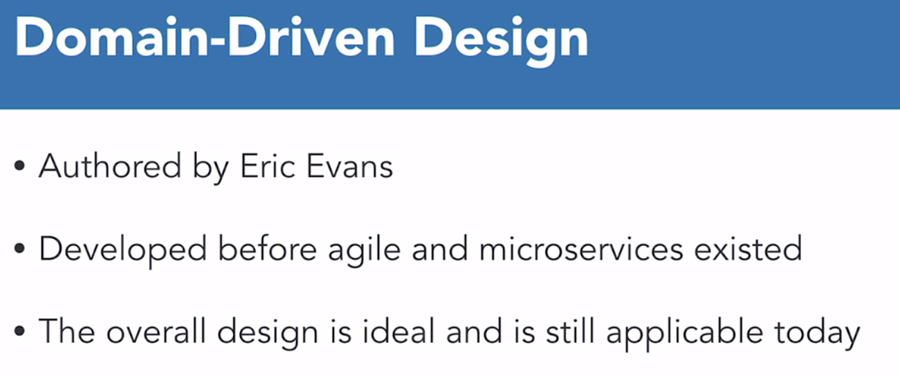

- Collaborative
  - Business people and developers must work together daily througout the project
- Modeling
  - Struccture of the code models 1-to-1 to the structure of the domain
  - All collaborators can make sense of the structure
  - Changes are made to the domain which maps to where code changes should occur
- Incremental
  - Come up with only enough architecture to solve the immediate problem
  - The code evolves as you learn more about the problem and more architecture is added
  - DDD follows an agile workflow

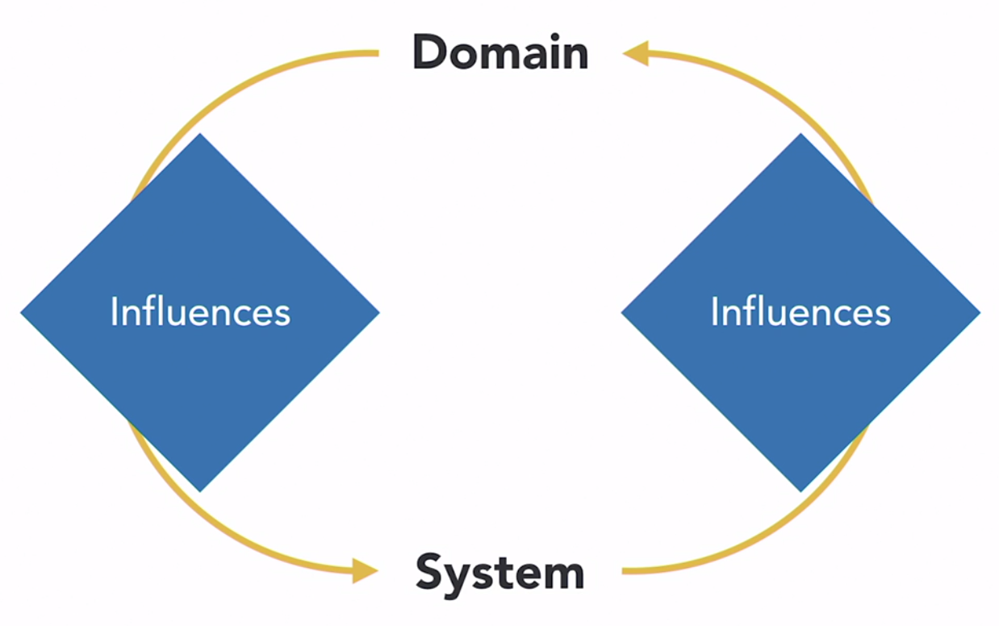

### Agile Environment

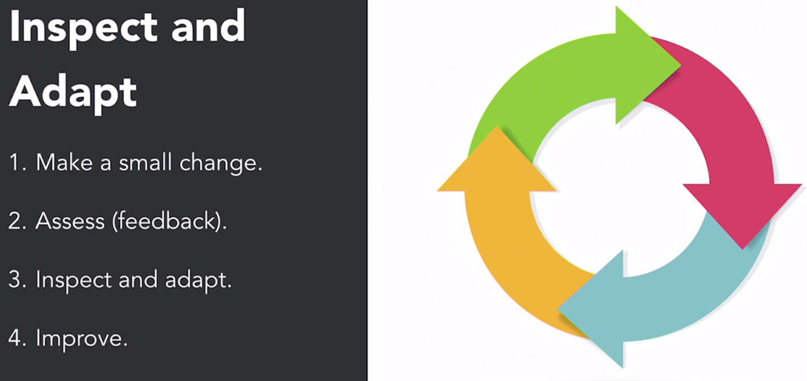
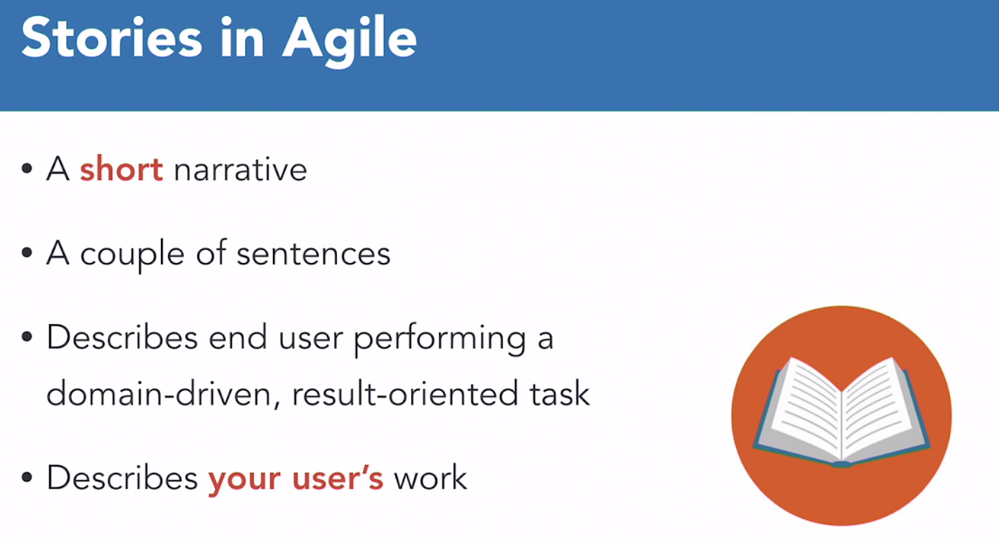

## Microservices and Monoliths

### Monolith

- Tends to access data only
- Hard to update
- Hard to deploy
- Hard to maintain
- Accretes cruft
- Agility in virtually impossible

### Microservices

- Small
- Independently deployable
- Hide implementation details
- Modeled around business concepts
- Descentralized
- Highly observable
- Autonomous

## Bounded Contexts and Entities

### Bounded Context

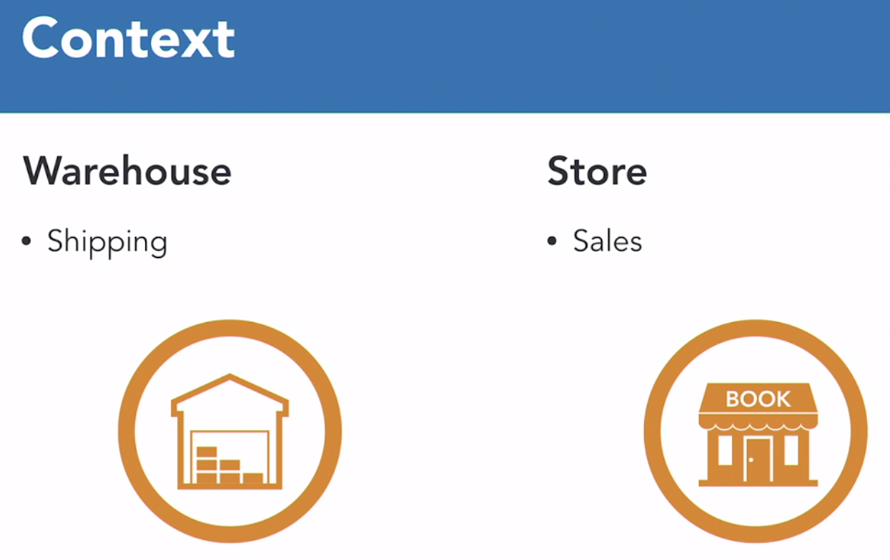

- Natural division within the business
- What are the responsibilities of the people working within that context

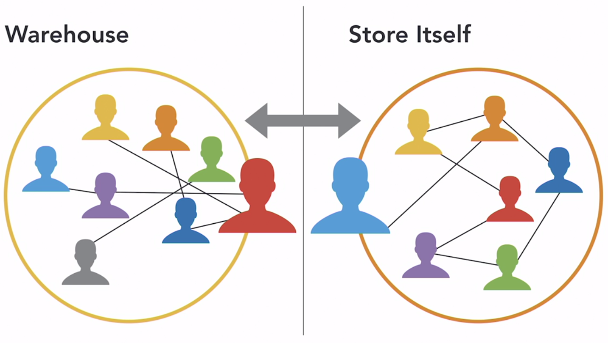

- Entity

  - Much like an object/class in the OOP world
  - Has one job and does one thing
  - Does that in a specific context

- Aggregate

  - Collection of entities you talk to through a single portal

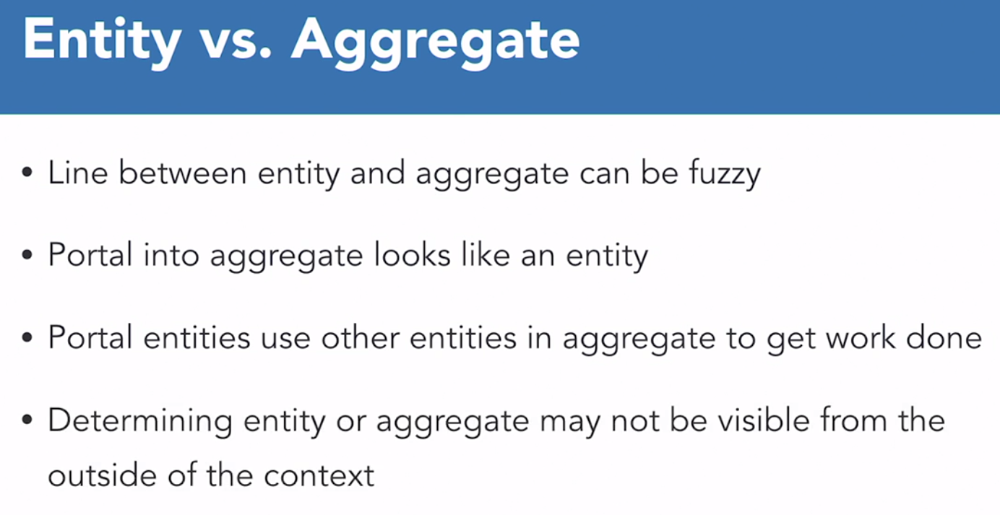

- Portal Entity
  - Uses other entities within an aggregate to accomplish tasks

### Ubiquitous Language

- People working within a context use a language on their own
- Language of one context is different than other contexts
- The language itself will the reflected within the code
- Names
  - Actors: people
  - Roles: tasks
  - Actors may accomplish tasks in different roles
  - Entities are named after roles, not actors

### Same name, different entity

#### BAD

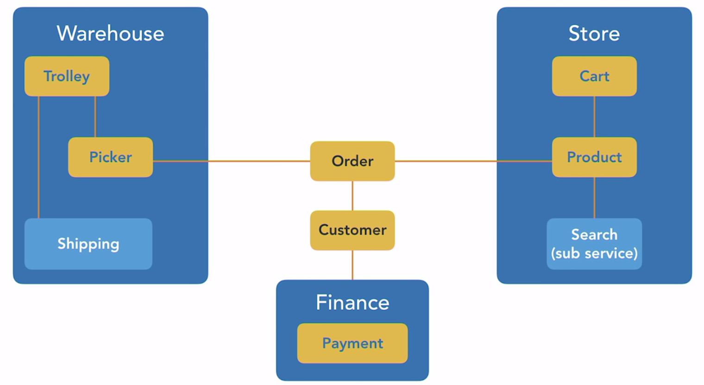

#### GOOD

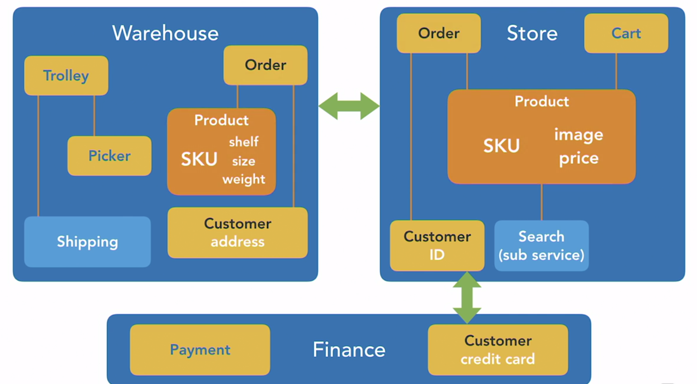

- Every entity should be associated with one context
- Move away from relational database thinking
- Bad to have single product-object in multiple contexts

### Reactive vs. Declarative Systems

#### Declarative

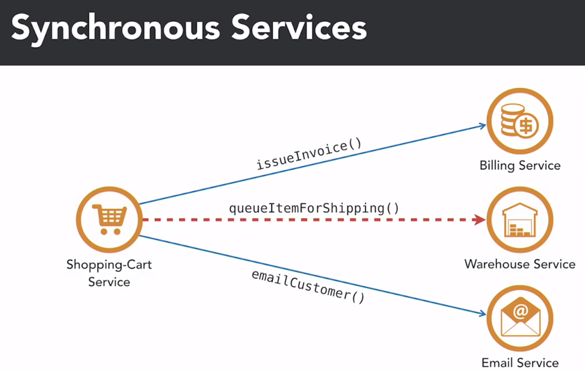

- Orchestrated
- Making a change to any downstream service will also impact the upstream

#### Reactive

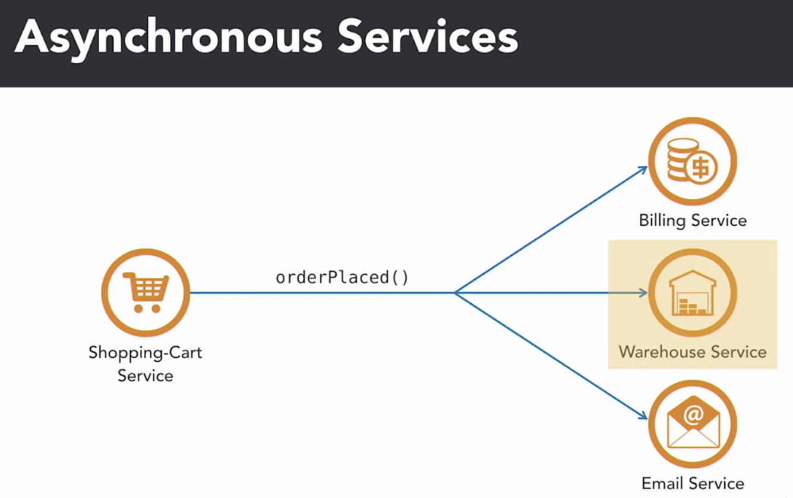

- Choreography
- Eliminates coupling relationships between downstream and upstream services
- Can add/change downstream services without disrupting upstream services
- Publish-subscribe model

### Event Storming

- Can be used to analyze the domain/business
- Can be used to develop code that is modeling the business
- Collaborative technique with business people
- Design a system that models the structure and flow of activities within the business
- Don't model too much at once
- Focus on a specific story
- Model that part of the system in order to implement that story

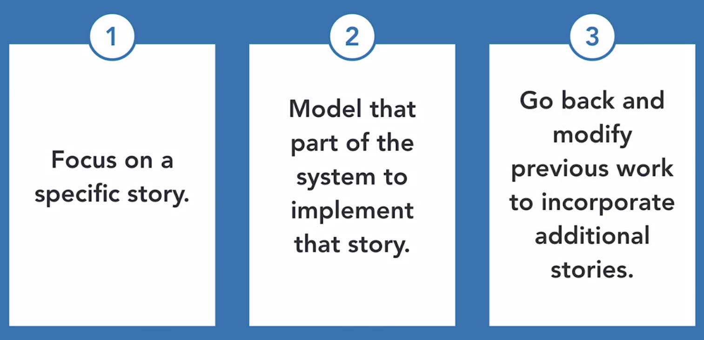

#### Event

- Happens at business level
  - Order submitted
  - Payment received
  - Nightly reconciliation completed
- Should be specified in past tense
- Something that has happened that will trigger something else to happen

#### Setup

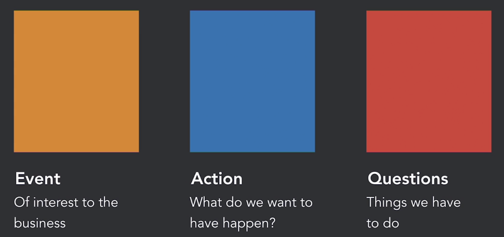
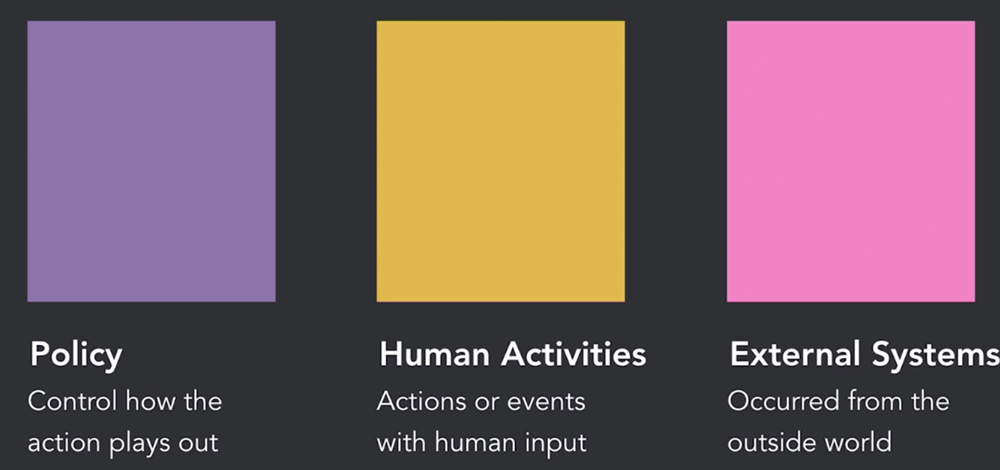

- Entire flow of events through a system
- Who is handling those events
- Contexts to which people belong

#### Demo: Events

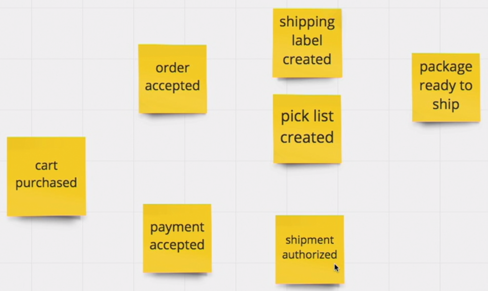

#### Demo: Activities Flow

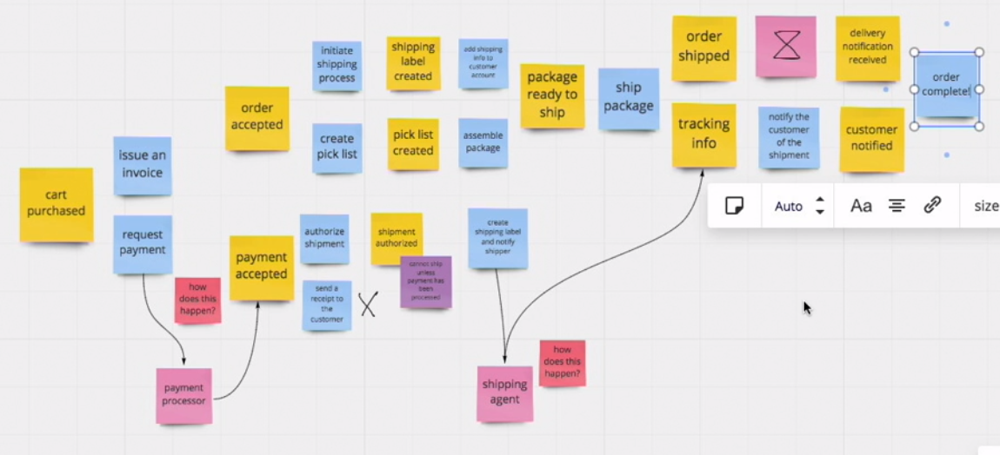

#### Demo: Entities

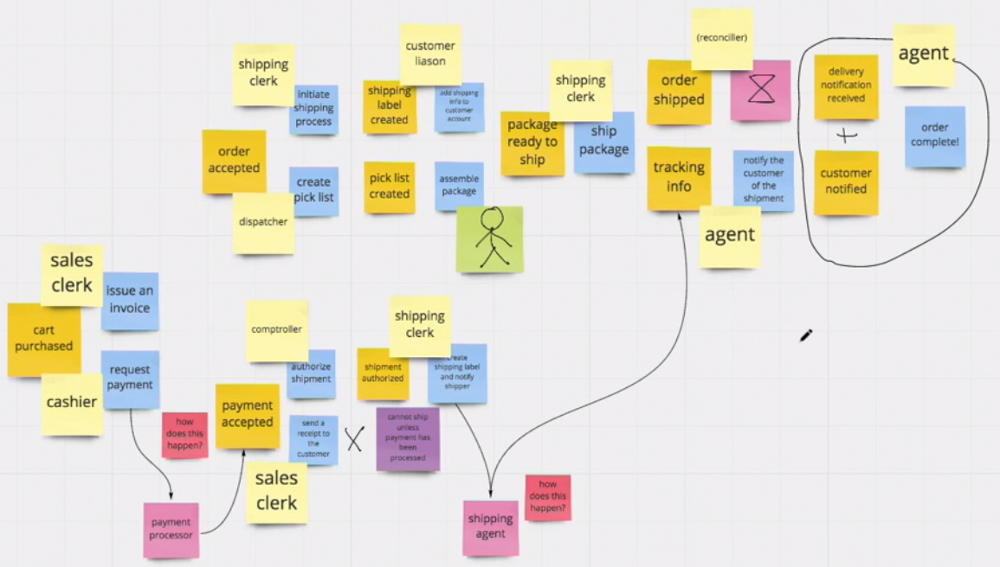

#### Demo: Contexts

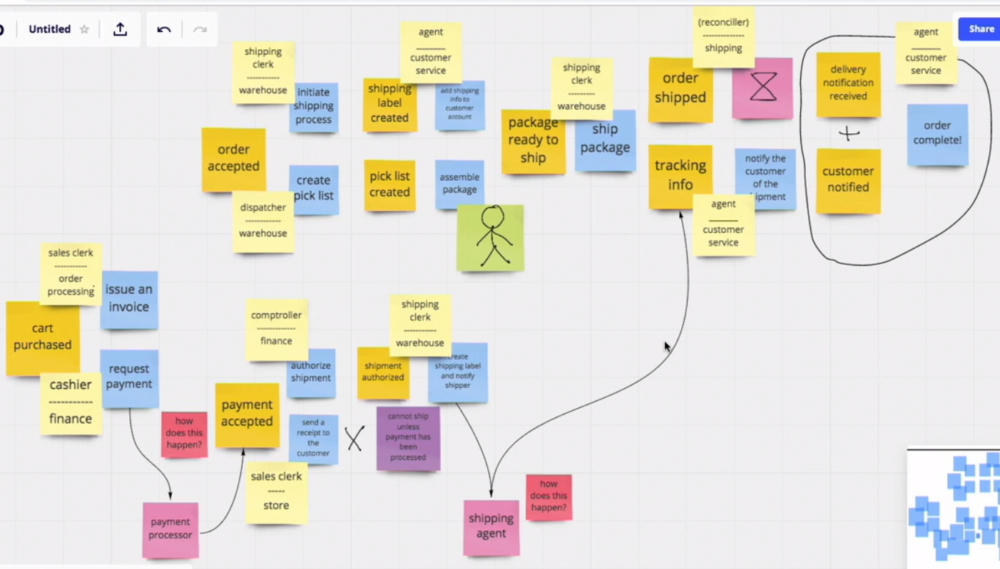

#### Demo: Context Maps

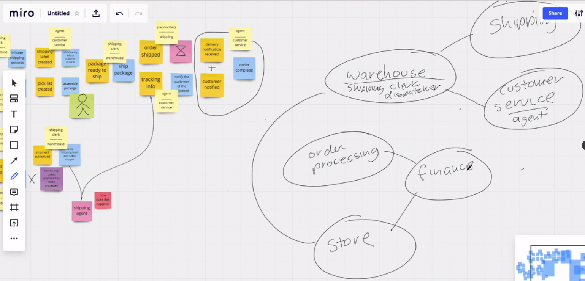
