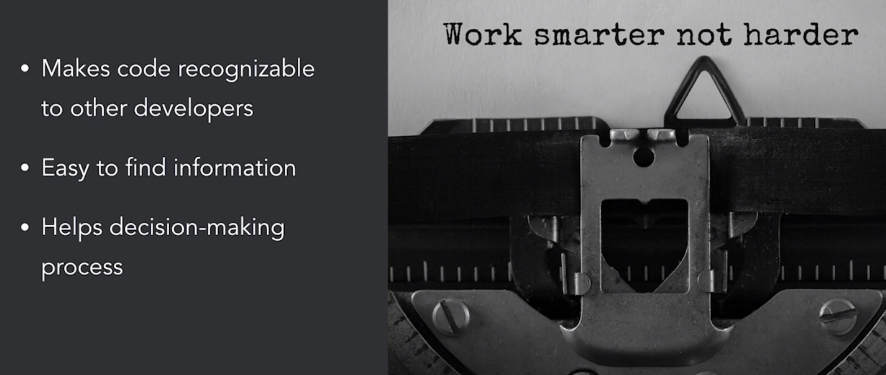

# Software Architecture: Patterns for Developers

## The Context of Software Architecture Patterns

### Caveats

- Other solutions possible
- No guarantee
- Just a starting point

- Application Landscape Patterns

  - "The neighborhood"
  - Single application to the end user
  - Multiple applications behind the scenes possible

- Application Structure Patterns

  - "The individual houses"
  - Single executable
  - Can be part of a larger application landscape

- User Interface Patterns
  - "The front door"

## Application Landscape Patterns

### Monolith

- Advantages

  - Easy to understand, implement, and test
  - Easy deployment
  - Ideal for limited Scope

- Disadvantages
  - Tight coupling
  - Easily leads to complex code
  - One size fits all for every subdomain

### N-tier

- Multiple tiers
- Tier performs specific task
- Tiers can be physically separated
- Tiers are **not** layers
- Technical boundaries

- Advantages

  - Independ development
  - Scalability

- Disadvantages
  - Changes ripple through tiers

### Service-oriented Architecture

- Multiple Services
- Each service is a business activity
- Service composability
- Contract standardization
- Enterprise service bus

- Advantages

  - Services are loosely coupled
  - Scalability
  - No duplication of functionality

- Disadvantages
  - Reduced agility and team autonomy
  - Costly
  - Many different views

### Microservices

- Mulitple services
- Each service is a business activity
- Teams run the service
- No logic-heavy enterprise service bus
- Maximum automation

- Advantages

  - Services are loosely coupled and easily scalable
  - Increased agility
  - Reliability
  - Designed to handle failures

- Disadvantages
  - Boundaries nto always clear
  - Communcation patterns can become complex

### Serverless

- Advantages

  - Scaling
  - Cost
  - Experimentation

- Disadvantages
  - Vendor dependency
  - Application state management
  - Cold start: first invocation takes longer

### Peer-to-peer

- No central server
- No constant connection
- Dynamically discoverable

- Advantages

  - Scaling
  - Cost
  - Sharing resources

- Disadvantages
  - Security issues
  - Only for specific scenarios
  - Nontrivial to code

## Application Structure Patterns

### Layered

- Advantages

  - Well-known among developers
  - Easy to organize

- Disadvantages
  - Can lead to monolithic applications
  - Verbosity (need to write lots of code)

### Microkernel (plugin)

- Task scheduler
- Workflow
- Data processing
- Browser
- Graphic designer

- Advantages

  - Flexibility
  - Clean separation
  - Separate teams possible
  - Add and remove functionality at runtime

- Disadvantages
  - Core API might not fit future plugins
  - Can the plugins be trusted?
  - Not always clear what belongs in the core

### CQRS (Command Query Responsibility Segregation)

- Two models: read/query and write/command
- Allows for scenario-specific queries
- Synchronization required
- Different from event sourcing

- Advantages

  - Simpler queries
  - Faster and more scalable read queries
  - Easier to communicate with stakeholders

- Disadvantages
  - Added complexity
  - Learning curve
  - Out-of-sync between write and read replicas: data inconsistences
  - Eventual consistency

### Event Sourcing

- Store events instead of the current state
- Event = something that happened in the past
- Rehydration or replay

- Advantages

  - Trace of events
  - Audit trail
  - Business language
  - Event replay

- Disadvantages
  - Replay and external systems
  - Event structure changes
  - Snapshots

### CQRS and Event Sourcing

- Not for simpler domains
- Start with event sourcing
- Add CQRS later

- Advantages

  - Simpler and faster queries
  - Audit trail
  - Trace of events
  - Scalable
  - Business language

- Disadvantages
  - Data inconsistencies
  - Event structure changes
  - Added complexity
  - Learning curve

## UI Patterns

### MVC (Model-View-Controller)

- Advantages

  - Separation of concerns
  - Parallel development
  - Popular in web frameworks

- Disadvantages
  - Bloated controllers
  - Means different things for different programmers

### MVP (Model-View-Presenter)

- Advantages

  - Great for desktop applications
  - Separation of concerns
  - Testability

- Disadvantages
  - Bloated presenters
  - Desktop applications are less popular
  - MVVM pattern

### MVVM (Model-View-ViewModel)

- Advantages

  - Great for desktop and mobile applications
  - Separation of concerns
  - Testability

- Disadvantages
  - Overkill for simpler interfaces
  - Desktop applications are less popular
  - Difficult to debug (data bindings)

### MVC, MVP and MVVM comparison

- Decoupling view and model
- Extra component in between
- Increased testability

