# Cloud Essentials Learning Path

<https://explore.skillbuilder.aws/learn/lp/82/cloud-essentials-learning-plan>

---

## Overview

## [Guide](./media/Ramp-Up_Guide_CloudPractitioner.pdf)

---

## 1 - Job Roles in the Cloud

### 1.1 AWS Cloud for Business

More companies are seeing the value and benefit of moving to a cloud environment.

The traditional on-premises model for managing IT applications and infrastructure is highly manual and often uses expensive equipment at less than full capacity. In contrast, an AWS Cloud environment helps businesses drive innovation because of its ability to increase development speed and provide near-limitless scale. And the speed, scale, innovation, and productivity benefits help businesses pursue bigger, broader digital opportunities, now and in the future.

Speed: With the AWS Cloud, organizations can experiment with applications and new business models at lower cost and greater speed.

Scale: The AWS Cloud creates opportunities for organizations to scale products almost instantaneously to a broader set of customer segments, geographies, and channels.

Innovation: Using the AWS Cloud means that roles that were once required for on premises will move to a shared responsibility model. This frees up your team to innovate and use technologies such as advanced analytics, the Internet of Things, or IoT, and automation at scale.

Productivity: The adoption of cloud principles such as infrastructure and security as code helps to automate compliance and other routine processes, which speeds up productivity.

The AWS Global Cloud Infrastructure is the most secure, extensive, and reliable cloud platform, offering more than 200 fully featured services from data centers globally. Whether you need to deploy your application workloads across the globe in a single click or you want to build and deploy specific applications closer to your end-users with single-digit millisecond latency, AWS provides you the cloud infrastructure where and when you need it.

### 1.2 On-premises Job Roles

Each organization has a different way to structure their IT department; there is no set rule. Today, you will learn about the critical roles of an on-premises IT department.

#### 1.2.1 IT Solutions Architect

The IT Solutions Architect creates the high-level solutions for business applications, systems, portfolios, infrastructures, or an entire enterprise.

They develop IT services and solutions for companies and organizations and often design and manage communications, security, networking, and storage.

#### 1.2.2 System Administrator

The System Administrator keeps servers operational. They ensure servers meet uptime goals. They are responsible for patching or upgrading operating systems, hardware, and hypervisors. They make sure system backups occur.

#### 1.2.3 Network Administrator

Network Administrators administer network access points. They are concerned with security around personnel access, configurations, and virtual private networks (VPNs).

#### 1.2.4 Desktop Administrator

The Desktop Administrator administers installing and maintaining applications on desktop and laptop computers. They work with the Network Administrator for network and security configurations.

#### 1.2.5 Application Administrator

The Applications Administrator handles web and customer applications. They work with the System Administrator to host and maintain applications on servers. They also partner with the Network Administrator for application access control.

#### 1.2.6 Database Administrator

The Database Administrator administers databases by working with the System Administrator on the servers that the database is on. They work with the Network Administrator for database access control.

### 1.3 Shared Responsibility Model

<https://aws.amazon.com/compliance/shared-responsibility-model/>

**AWS is responsible for security of the cloud and customer is responsible for security in the cloud.**

This shared model can help relieve customers' operational burden

- AWS operates, manages, and controls the components from the host operating system and virtualization layer down to the physical security of the facilities in which the service operates.
- The customer assumes responsibility and management of the guest operating system, including updates and security patches. The customer also assumes responsibility for other associated application software and the configuration of the AWS provided security group firewall.

### 1.4 Job Roles in the Cloud

#### 1.4.1 Cloud Architect

The Cloud Architect is responsible for delivering an overall cloud strategy and is in charge of the entire cloud environment. The Cloud Architect builds a business’s cloud architecture blueprint to deliver highly available, cost-efficient, and scalable cloud environments.

This role supervises deployment in the cloud environment and application architecture for all aspects of the cloud. It is critical that a Cloud Architect is knowledgeable enough to be your business’s AWS Cloud subject matter expert and the go-to for anything related to the cloud.

- Understands how services are connected and the integration of services
- Understands Amazon CloudWatch and logging
- Understands AWS Identity and Access Management (IAM) and the security involved

#### 1.4.2 System Administrator

The System Administrator is responsible for overall performance of cloud systems. They are the glue that keeps systems working together by managing configurations, completing detailed tasks, and assisting Database Administrators with setting up database servers in the cloud.

A System Administrator in the cloud maintains data integrity by deploying, configuring, and monitoring hybrid and cloud solutions instead of infrastructure performance and maintenance.

It’s essential that the System Administrator is adaptable and proficient with configuration management, requirements gathering, deployment planning, and completing detailed hands-on tasks.

- Proficient with hands-on tasks and detailed configuration changes
- Understands configuration management
- Proficient with requirement gathering and translating to deployments

#### 1.4.3 Security Administrator

When using AWS, you gain the control and confidence you need to securely run a business with the most flexible and secure cloud computing environment available today. Going back to our shared responsibility model, security and compliance is a shared responsibility between AWS and the customer. **AWS is responsible for the security of the cloud, which includes protecting the infrastructure that runs all of the services offered in the AWS Cloud. The customer is responsible for security in the cloud. This is the Security Administrator’s primary responsibility.**

A Security Administrator must be someone that is trusted and exceptionally knowledgeable because they are responsible for the overall integrity, confidentiality, and protection of data and resources in the cloud.

This role is a combination of reactive (investigates when security incidents or concerns are reported) and proactive (puts standards and development processes in place to reduce the number of security incidents). While the Security Administrator does not need to know all of the details of cloud operations, they do define security requirements based on their company’s security and regulatory requirements.

To ensure security in the cloud, the Security Administrator must have a deep understanding of security rules and requirements applicable to their unique business. They must be highly resourceful, because it isn’t possible to memorize every rule or regulation. This role communicates these requirements down to engineers and up to decision makers to understand and address security risks.

- Defines security requirements for enterprise-level businesses based on their security and regulatory requirements
- Understands security rules and requirements
- Communicates security rules down to engineers and up to decision makers to understand and address security risk
- Resourceful because it is not possible to memorize all regulatory requirements
- Researches and is resourceful with contacts to determine an answer to address security

#### 1.4.4 DevOps Administrator

The DevOps Administrator optimizes the use of the AWS Cloud. They help businesses operate at a larger, faster scale by managing developers and orchestrating the numerous tools and stages in the pipeline.

This role creates and maintains processes so that teams and developers can follow the model of small, rapid releases. To do this, this role manages the release cycle to ensure that there is enough pipeline to evaluate changes that need to be made, tested, and pushed to production. Additionally, the DevOps Administrator conducts tests and backs out changes if there are issues. They have the ability to quickly roll back changes if something doesn’t work.

Because the DevOps Administrator is responsible for orchestrating the pipeline, this role must be proficient with programming scripting languages, operations, QA, and testing.

- Applies programming scripting languages with proficiency
- Understands and applies QA and testing
- Understands operations and manages developers
- Orchestrates the many tools and stages in the pipeline

### 1.5 Map On-premises Job Roles to Cloud Job Roles

#### 1.5.1 Cloud Architect

This is typically a lateral move for an IT Solutions Architect. Their day-to-day concern changes from on-premises issues with hardware, HVAC, or server upgrades, for example, to a focus on cloud technology. An example of a task for a Cloud Architect might be to assist a System Administrator who needs help with an integration.

#### 1.5.2 DevOps Administrator

DevOps Administrators implement continuous build, integration, deployment, and infrastructure as code. They review and recommend operational improvements. DevOps Administrators also perform application testing and recovery.

A DevOps Administrator in the cloud is no longer as dependent on other teams to complete their release cycles. It is common for an Application Administrator to move into the DevOps role. Database Administrators can also move into this role, but there might be more of a learning curve as they must learn about the data operations pipeline.

DevOps Administrators typically oversee database and developer teams.

### 1.6 Grow AWS Cloud competences

- [AWS Skills Builder](https://explore.skillbuilder.aws/)
- [AWS Skills Center](https://aws.amazon.com/training/skills-centers/)

---

## 2 - AWS Cloud Practitioner Essentials

## 2.1 Introduction to Amazon Web Services

### 2.1.1 Introduction

### 2.1.2 Cloud Computing

**Cloud computing is the on-demand delivery of IT resources over the internet with pay-as-you-go pricing.**

### 2.1.2.1 Deployment models

- Cloud-based deployment
  - Run all parts of the application in the cloud.
  - Migrate existing applications to the cloud.
  - Design and build new applications in the cloud.
- On-premises deployment (a.k.a _private cloud_ deployment)
  - Deploy resources by using virtualization and resource management tools.
  - Increase resource utilization by using application management and virtualization technologies.
- Hybrid deployment
  - Connect cloud-based resources to on-premises infrastructure.
  - Integrate cloud-based resources with legacy IT applications.

### 2.1.2.2 Benefits of Cloud Computing

- **Trade upfront expense for variable expense**
  Upfront expense refers to data centers, physical servers, and other resources that you would need to invest in before using them. Variable expense means you only pay for computing resources you consume instead of investing heavily in data centers and servers before you know how you’re going to use them.
  By taking a cloud computing approach that offers the benefit of variable expense, companies can implement innovative solutions while saving on costs.

- **Stop spending money to run and maintain data centers**
  Computing in data centers often requires you to spend more money and time managing infrastructure and servers.
  A benefit of cloud computing is the ability to focus less on these tasks and more on your applications and customers.

- **Stop guessing capacity**
  With cloud computing, you don’t have to predict how much infrastructure capacity you will need before deploying an application.
  For example, you can launch Amazon EC2 instances when needed, and pay only for the compute time you use. Instead of paying for unused resources or having to deal with limited capacity, you can access only the capacity that you need. You can also scale in or scale out in response to demand.

- **Benefit from massive economies of scale**
  By using cloud computing, you can achieve a lower variable cost than you can get on your own.
  Because usage from hundreds of thousands of customers can aggregate in the cloud, providers, such as AWS, can achieve higher economies of scale. The economy of scale translates into lower pay-as-you-go prices.

- **Increase speed and agility**
  The flexibility of cloud computing makes it easier for you to develop and deploy applications.
  This flexibility provides you with more time to experiment and innovate. When computing in data centers, it may take weeks to obtain new resources that you need. By comparison, cloud computing enables you to access new resources within minutes.

- **Go global in minutes**
  The global footprint of the AWS Cloud enables you to deploy applications to customers around the world quickly, while providing them with low latency. This means that even if you are located in a different part of the world than your customers, customers are able to access your applications with minimal delays.

### 2.1.3 Quiz

## 2.2 [Compute in the Cloud](https://aws.amazon.com/products/compute)

### 2.2.1 Introduction

1. First, you launch an instance. Begin by selecting a template with basic configurations for your instance. These configurations include the operating system, application server, or applications. You also select the instance type, which is the specific hardware configuration of your instance.
2. Next, connect to the instance. You can connect to the instance in several ways. Your programs and applications have multiple different methods to connect directly to the instance and exchange data. Users can also connect to the instance by logging in and accessing the computer desktop.
3. After you have connected to the instance, you can begin using it. You can run commands to install software, add storage, copy and organize files, and more.

### 2.2.2 [Amazon EC2 Instance Types](https://aws.amazon.com/ec2/instance-types/)

- **General Purpose Instances**
  Suppose that you have an application in which the resource needs for compute, memory, and networking are roughly equivalent. You might consider running it on a general purpose instance because the application does not require optimization in any single resource area.
  provide a balance of compute, memory, and networking resources. You can use them for a variety of workloads, such as:

  - application servers
  - gaming servers
  - backend servers for enterprise applications
  - small and medium databases

- **Compute Optimized Instances**
  are ideal for compute-bound applications that benefit from high-performance processors. Like general purpose instances, you can use compute optimized instances for workloads such as web, application, and gaming servers.
  However, the difference is compute optimized applications are ideal for high-performance web servers, compute-intensive applications servers, and dedicated gaming servers. You can also use compute optimized instances for batch processing workloads that require processing many transactions in a single group.

- **Memory Optimized Instances**
  are designed to deliver fast performance for workloads that process large datasets in memory. In computing, memory is a temporary storage area. It holds all the data and instructions that a central processing unit (CPU) needs to be able to complete actions. Before a computer program or application is able to run, it is loaded from storage into memory. This preloading process gives the CPU direct access to the computer program.
  Suppose that you have a workload that requires large amounts of data to be preloaded before running an application. This scenario might be a high-performance database or a workload that involves performing real-time processing of a large amount of unstructured data. In these types of use cases, consider using a memory optimized instance. Memory optimized instances enable you to run workloads with high memory needs and receive great performance.

- **Accelerated Computing Instances**
  use hardware accelerators, or coprocessors, to perform some functions more efficiently than is possible in software running on CPUs. Examples of these functions include floating-point number calculations, graphics processing, and data pattern matching.
  In computing, a hardware accelerator is a component that can expedite data processing. Accelerated computing instances are ideal for workloads such as graphics applications, game streaming, and application streaming.

- **Storage Optimized Instances**
  re designed for workloads that require high, sequential read and write access to large datasets on local storage. Examples of workloads suitable for storage optimized instances include distributed file systems, data warehousing applications, and high-frequency online transaction processing (OLTP) systems.
  In computing, the term input/output operations per second (IOPS) is a metric that measures the performance of a storage device. It indicates how many different input or output operations a device can perform in one second. Storage optimized instances are designed to deliver tens of thousands of low-latency, random IOPS to applications.
  You can think of input operations as data put into a system, such as records entered into a database. An output operation is data generated by a server. An example of output might be the analytics performed on the records in a database. If you have an application that has a high IOPS requirement, a storage optimized instance can provide better performance over other instance types not optimized for this kind of use case.

#### 2.2.2.1 Knowledge Check

### 2.2.3 Amazon Ec2 pricing

- **On-demand**
  Ideal for short-term, irregular workloads that cannot be interrupted. No upfront costs or minimum contracts apply. The instances run continuously until you stop them, and you pay for only the compute time you use.
  Sample use cases for On-Demand Instances include developing and testing applications and running applications that have unpredictable usage patterns. On-Demand Instances are not recommended for workloads that last a year or longer because these workloads can experience greater cost savings using Reserved Instances.

- **EC2 Savings Plans**
  AWS offers Savings Plans for several compute services, including Amazon EC2. Amazon EC2 Savings Plans enable you to reduce your compute costs by committing to a consistent amount of compute usage for a 1-year or 3-year term. This term commitment results in savings of up to 72% over On-Demand costs.
  Any usage up to the commitment is charged at the discounted Savings Plan rate (for example, $10 an hour). Any usage beyond the commitment is charged at regular On-Demand rates.
  Later in this course, you will review AWS Cost Explorer, a tool that enables you to visualize, understand, and manage your AWS costs and usage over time. If you are considering your options for Savings Plans, AWS Cost Explorer can analyze your Amazon EC2 usage over the past 7, 30, or 60 days. AWS Cost Explorer also provides customized recommendations for Savings Plans. These recommendations estimate how much you could save on your monthly Amazon EC2 costs, based on previous Amazon EC2 usage and the hourly commitment amount in a 1-year or 3-year Savings Plan.

- **Reserved Instances**
  A billing discount applied to the use of On-Demand Instances in your account. You can purchase Standard Reserved and Convertible Reserved Instances for a 1-year or 3-year term, and Scheduled Reserved Instances for a 1-year term. You realize greater cost savings with the 3-year option.
  At the end of a Reserved Instance term, you can continue using the Amazon EC2 instance without interruption. However, you are charged On-Demand rates until you do one of the following:

  - Terminate the instance.
  - Purchase a new Reserved Instance that matches the instance attributes (instance type, Region, tenancy, and platform).

- **Spot Instances**
  Ideal for workloads with flexible start and end times, or that can withstand interruptions. Spot Instances use unused Amazon EC2 computing capacity and offer you cost savings at up to 90% off of On-Demand prices.
  Suppose that you have a background processing job that can start and stop as needed (such as the data processing job for a customer survey). You want to start and stop the processing job without affecting the overall operations of your business. If you make a Spot request and Amazon EC2 capacity is available, your Spot Instance launches. However, if you make a Spot request and Amazon EC2 capacity is unavailable, the request is not successful until capacity becomes available. The unavailable capacity might delay the launch of your background processing job.
  After you have launched a Spot Instance, if capacity is no longer available or demand for Spot Instances increases, your instance may be interrupted. This might not pose any issues for your background processing job. However, in the earlier example of developing and testing applications, you would most likely want to avoid unexpected interruptions. Therefore, choose a different EC2 instance type that is ideal for those tasks.

- **Dedicated Hosts**
  Physical servers with Amazon EC2 instance capacity that is fully dedicated to your use.
  You can use your existing per-socket, per-core, or per-VM software licenses to help maintain license compliance. You can purchase On-Demand Dedicated Hosts and Dedicated Hosts Reservations. Of all the Amazon EC2 options that were covered, Dedicated Hosts are the most expensive.

### 2.2.4 Scaling Amazon Ec2

#### 2.2.4.1 Scalability

involves beginning with only the resources you need and designing your architecture to automatically respond to changing demand by scaling out or in. As a result, you pay for only the resources you use. You don’t have to worry about a lack of computing capacity to meet your customers’ needs.

#### 2.2.4.2 Amazon EC2 Auto Scaling

### 2.2.5 Directing traffic with Elastic Load Balancing

**Regional Construct**
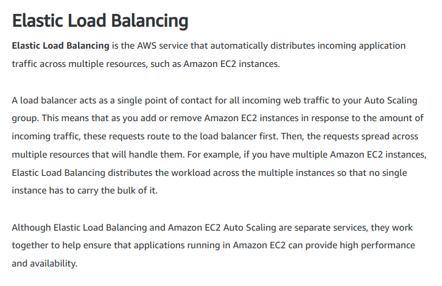
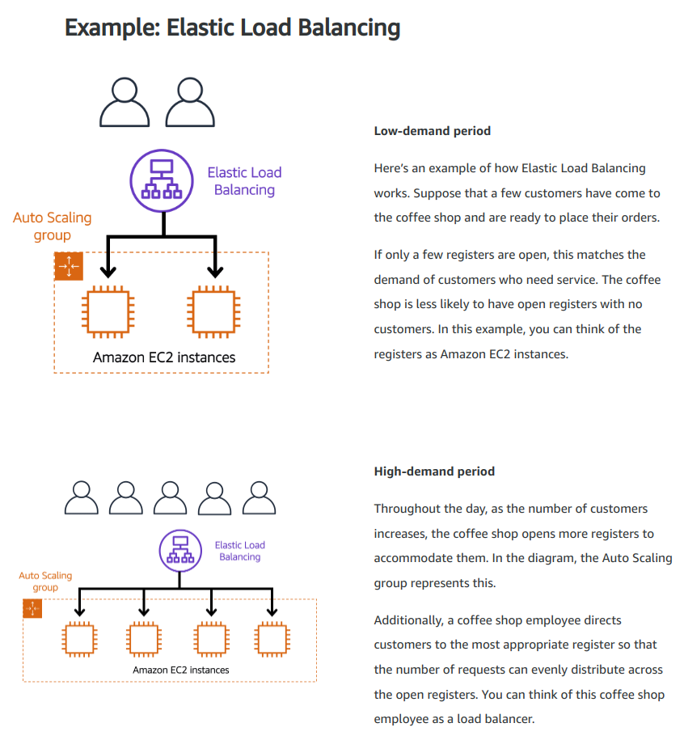

### 2.2.6 Messaging and Queueing

#### 2.2.6.1 Amazon Simple Notification Service (SNS)

- is a publish/subscribe service. Using Amazon SNS topics, a publisher publishes messages to subscribers.
- In Amazon SNS, subscribers can be web servers, email addresses, AWS Lambda functions, or several other options.

#### 2.2.6.2 Amazon Simple Queue Service (SQS)

For decoupled applications and microservices, Amazon SQS enables you to send, store, and retrieve messages between components.
This decoupled approach enables the separate components to work more efficiently and independently.

- you can send, store, and receive messages between software components, without losing messages or requiring other services to be available.
- In Amazon SQS, an application sends messages into a queue.
- A user or service retrieves a message from the queue, processes it, and then deletes it from the queue.

#### 2.2.6.3 Quiz

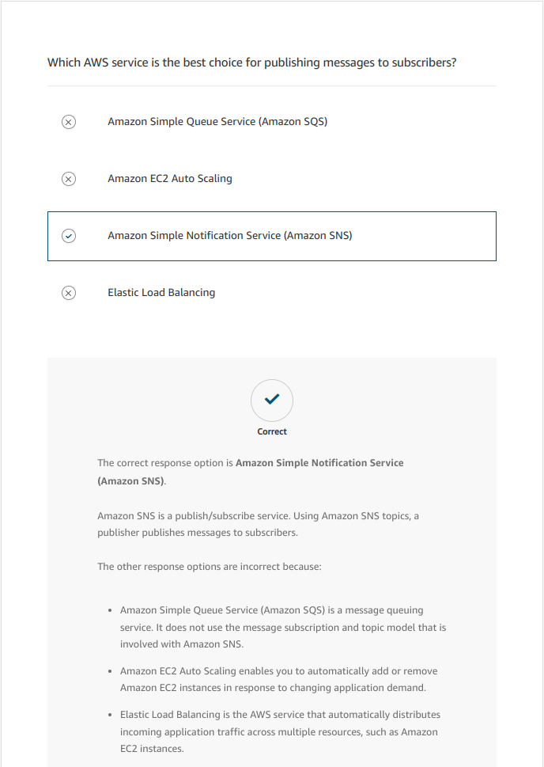

### 2.2.7 Additional Compute Services

#### 2.2.7.1 Serverless Computing

The term “serverless” means that your code runs on servers, but you do not need to provision or manage these servers. With serverless computing, you can focus more on innovating new products and features instead of maintaining servers.

Another benefit of serverless computing is the flexibility to scale serverless applications automatically. Serverless computing can adjust the applications' capacity by modifying the units of consumptions, such as throughput and memory.

#### 2.2.7.2 [AWS Lambda](https://aws.amazon.com/lambda)

Service that lets you run code without needing to provision or manage servers.

While using AWS Lambda, you pay only for the compute time that you consume. Charges apply only when your code is running. You can also run code for virtually any type of application or backend service, all with zero administration.

For example, a simple Lambda function might involve automatically resizing uploaded images to the AWS Cloud. In this case, the function triggers when uploading a new image.

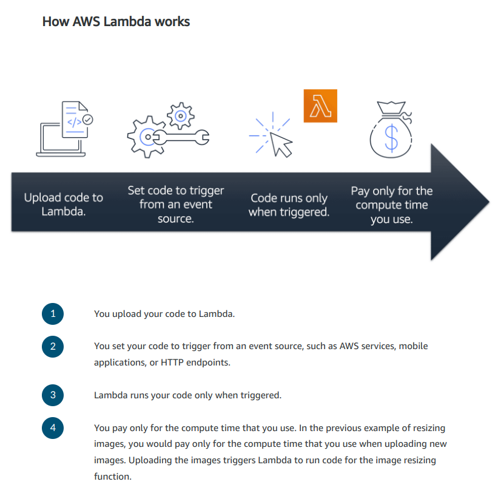

#### 2.2.7.3 Containers

Provide you with a standard way to package your application's code and dependencies into a single object.

You can also use containers for processes and workflows in which there are essential requirements for security, reliability, and scalability.

Container orchestration services help you to deploy, manage, and scale your containerized applications.

#### 2.2.7.4 Amazon Elastic Container Service ([Amazon ECS](https://aws.amazon.com/ecs/))

Highly scalable, high-performance container management system that enables you to run and scale containerized applications on AWS.

Amazon ECS supports Docker containers. [Docker](https://www.docker.com/) is a software platform that enables you to build, test, and deploy applications quickly. AWS supports the use of open-source Docker Community Edition and subscription-based Docker Enterprise Edition. With Amazon ECS, you can use API calls to launch and stop Docker-enabled applications.

#### 2.2.7.5 Amazon Elastic Kubernetes Service ([Amazon EKS](https://aws.amazon.com/eks/))

Fully managed service that you can use to run Kubernetes on AWS.

[Kubernetes](https://kubernetes.io/) is open-source software that enables you to deploy and manage containerized applications at scale. A large community of volunteers maintains Kubernetes, and AWS actively works together with the Kubernetes community. As new features and functionalities release for Kubernetes applications, you can easily apply these updates to your applications managed by Amazon EKS.

#### 2.2.7.6 [AWS Fargate](https://aws.amazon.com/fargate/)

Serverless compute engine for containers. It works with both Amazon ECS and Amazon EKS.

When using AWS Fargate, you do not need to provision or manage servers. AWS Fargate manages your server infrastructure for you. You can focus more on innovating and developing your applications, and you pay only for the resources that are required to run your containers.

### 2.2.8 Summary

**What is cloud computing and what does AWS offer?**

- We define cloud computing as the on-demand delivery of IT resources over the internet with pay-as-you-go pricing. This means that you can make requests for IT resources like compute, networking, storage, analytics, or other types of resources, and then they're made available for you on demand. You don't pay for the resource upfront. Instead, you just provision and pay at the end of the month.

AWS offers services and many categories that you use together to create your solutions.
We've only covered a few services so far, you learned about **Amazon EC2**.

- With EC2, you can dynamically spin up and spin down virtual servers called EC2 instances.
- When you launch an EC2 instance, you choose the instance family.
- The instance family determines the hardware the instance runs on.
- And you can have instances that are built for your specific purpose:
  - general purpose,
  - compute optimized,
  - memory optimized,
  - accelerated computing,
  - storage optimized.
- You can scale your EC2 instances either
  - vertically by resizing the instance,
  - or horizontally by launching new instances and adding them to the pool.
  - You can set up automated horizontal scaling, using Amazon EC2 Auto Scaling.
- EC2 instances have different pricing models:
  - On-Demand, which is the most flexible and has no contract,
  - Spot pricing, which allows you to utilize unused capacity at a discounted rate,
  - Dedicated Hosts or Reserved Instances, which allow you to enter into a contract with AWS to get a discounted rate when you commit to a certain level of usage,
  - Savings Plans which apply to AWS Lambda, and AWS Fargate, as well as EC2 instances.

Once you've scaled your EC2 instances out horizontally, you need something to distribute the incoming traffic across those instances.
This is where the **Elastic Load Balancer** comes into play.

We also covered messaging services:

- There is **Amazon Simple Queue Service or SQS**. This service allows you to decouple system components. Messages remain in the queue until they are either consumed or deleted.
- **Amazon Simple Notification Service or SNS**, is used for sending messages like emails, text messages, push notifications, or even HTTP requests. Once a message is published, it is sent to all of these subscribers.

There are container services like **Amazon Elastic Container Service, or ECS**.
And there's **Amazon Elastic Kubernetes Service, or EKS**.
Both of which are container orchestration tools. You can use these tools with EC2 instances, but if you don't want to manage that, you don't need to.
You can use **AWS Fargate**, which allows you to run your containers on top of a serverless compute platform.

Then there is **AWS Lambda**, which allows you to just upload your code, and configure it to run based on triggers.
And you only get charged for when the code is actually running. No containers, no virtual machines. Just code and configuration.

### 2.2.9 Quiz

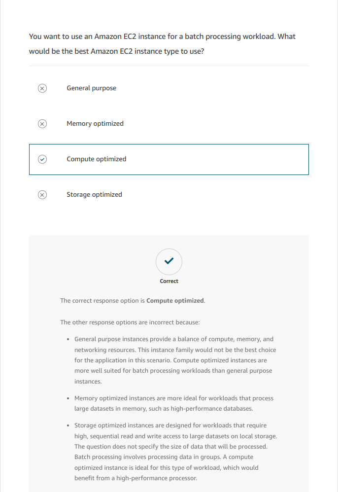
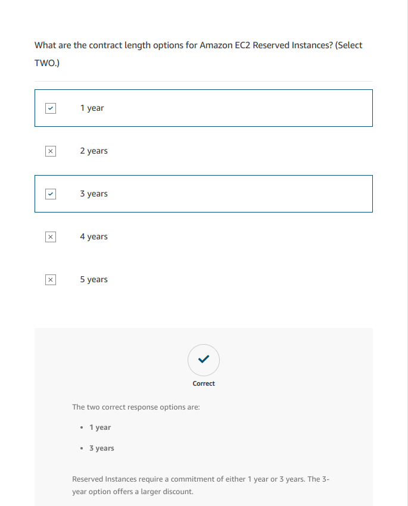
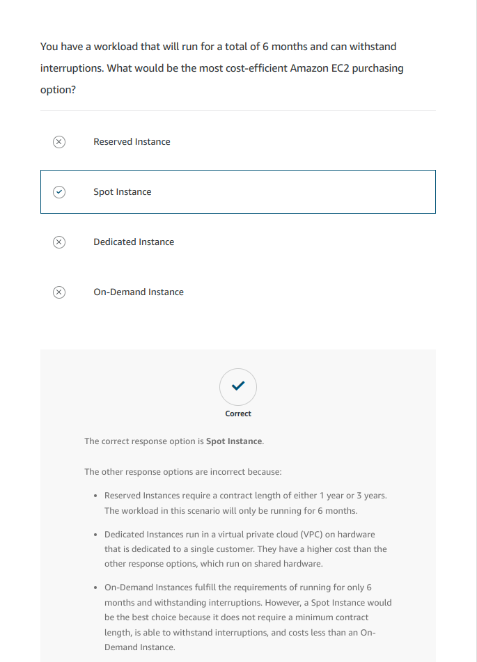
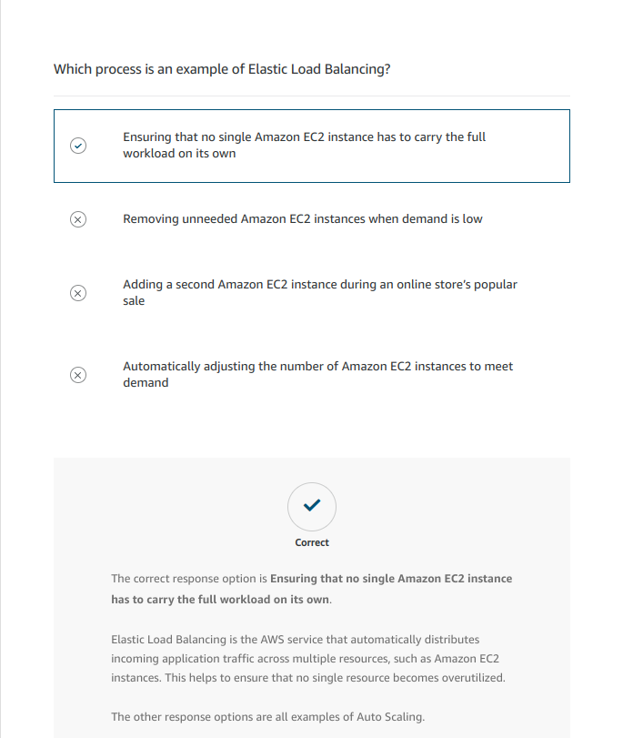
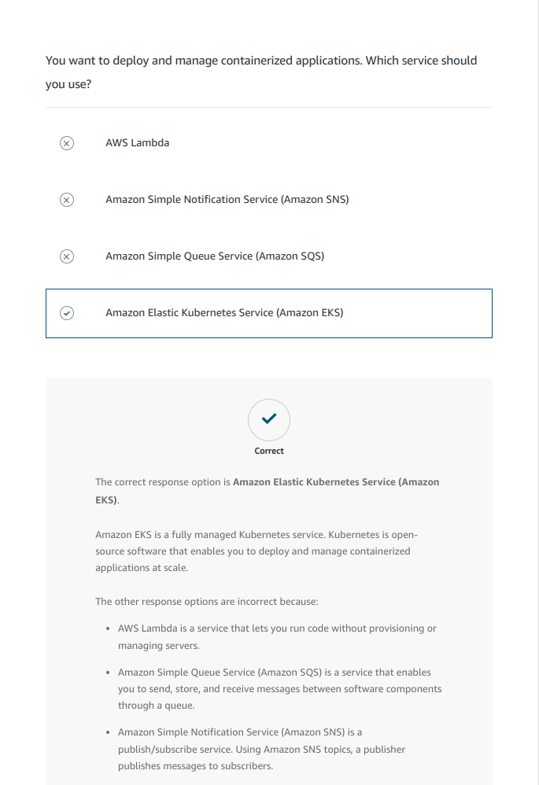

## 2.3 Global Infrastructure and Reliability

### 2.3.1 Introduction

Learning Objectives:

- Summarize the benefits of the AWS Global Infrastructure.
- Describe the basic concept of Availability Zones.
- Describe the benefits of Amazon CloudFront and edge locations.
- Compare different methods for provisioning AWS services

### 2.3.2 AWS Global Infrastructure

#### 2.3.2.1 Regions

When determining the right Region for your services, data, and applications, consider the following four business factors.

- **Compliance with data governance and legal requirements**
  Depending on your company and location, you might need to run your data out of specific areas.
  For example, if your company requires all of its data to reside within the boundaries of the UK, you would choose the London Region.

  Not all companies have location-specific data regulations, so you might need to focus more on the other three factors.

- **Proximity to your customers**
  Selecting a Region that is close to your customers will help you to get content to them faster.
  For example, your company is based in Washington, DC, and many of your customers live in Singapore.
  You might consider running your infrastructure in the Northern Virginia Region to be close to company headquarters, and run your applications from the Singapore Region.

- **Available services within a Region**
  Sometimes, the closest Region might not have all the features that you want to offer to customers.
  AWS is frequently innovating by creating new services and expanding on features within existing services.
  However, making new services available around the world sometimes requires AWS to build out physical hardware one Region at a time.

  Suppose that your developers want to build an application that uses Amazon Braket (AWS quantum computing platform).
  Amazon Braket is not yet available in every AWS Region around the world, so your developers would have to run it in one of the Regions that already offers it.

- **Pricing**
  Suppose that you are considering running applications in both the United States and Brazil.
  The way Brazil’s tax structure is set up, it might cost 50% more to run the same workload out of the São Paulo Region compared to the Oregon Region.
  You will learn in more detail that several factors determine pricing, but for now know that the cost of services can vary from Region to Region.

#### 2.3.2.2 Availability Zones

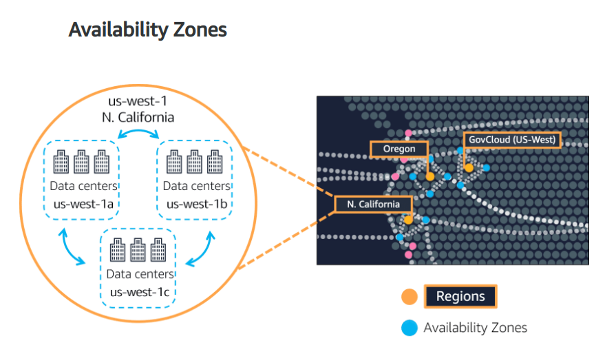

- Single data center or a group of data centers within a Region.
- Availability Zones are located tens of miles apart from each other.
- This is close enough to have low latency (the time between when content requested and received) between Availability Zones.
- However, if a disaster occurs in one part of the Region, they are distant enough to reduce the chance that multiple Availability Zones are affected.

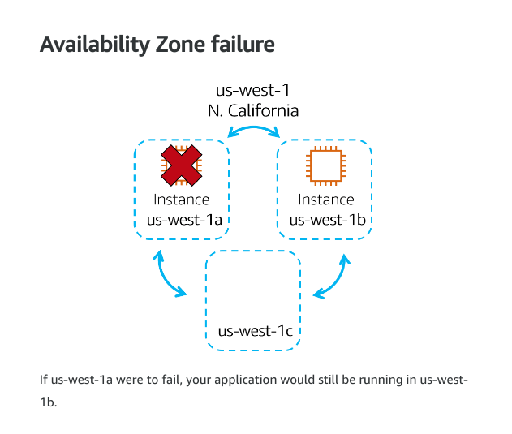
Planning for failure and deploying applications across multiple Availability Zones is an important part of building a resilient and highly available architecture.

#### 2.3.2.3 Knowledge Check

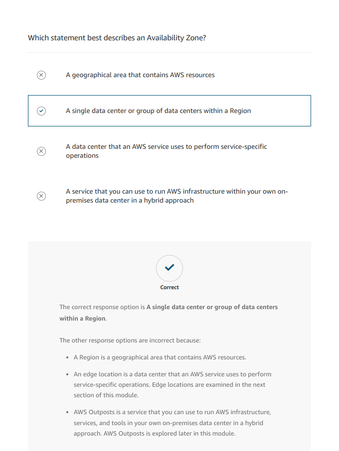

### 2.3.3 Edge Locations

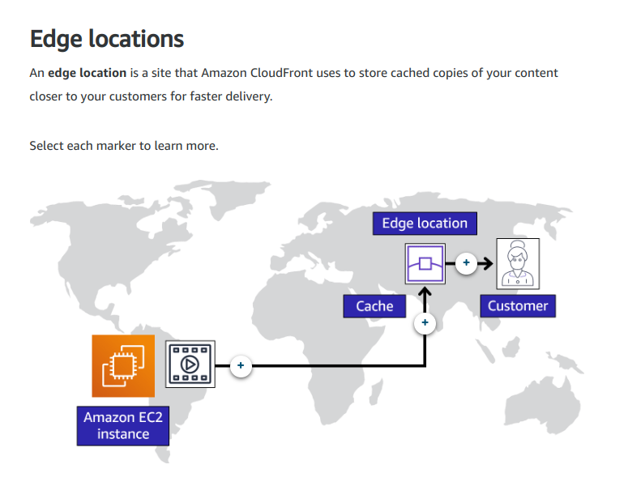

#### 2.3.3.1 Amazon CloudFront (Content Delivery Network - CDN)

- Service that helps deliver data, video, applications, and APIs to customers around the world with low latency and high transfer speeds.
- Amazon CloudFront uses what are called Edge locations, all around the world, to help accelerate communication with users, no matter where they are.

#### 2.3.3.2 Edge Locations

- Are separate from Regions, so you can push content from inside a Region to a collection of Edge locations around the world, in order to accelerate communication and content delivery.
- Also run a **DNS Service Amazon Route 53** helping direct customers to the correct web locations with reliably low latency.

#### 2.3.3.3 AWS Outposts

- AWS will basically install a fully operational mini Region, right inside your own data center.
- That's owned and operated by AWS, using 100% of AWS functionality, but isolated within your own building.

### 2.3.4 How to provision AWS resources

#### 2.3.4.1 Ways to interact with AWS Services

In AWS, **everything is an API call**.

- **AWS Management Console**
  Web-based interface for accessing and managing AWS services. You can quickly access recently used services and search for other services by name, keyword, or acronym.
  The console includes wizards and automated workflows that can simplify the process of completing tasks.

  You can also use the AWS Console mobile application to perform tasks such as monitoring resources, viewing alarms, and accessing billing information.
  Multiple identities can stay logged into the AWS Console mobile app at the same time.

- **AWS Command Line Interface (CLI)**
  To save time when making API requests, you can use the AWS Command Line Interface (AWS CLI).
  AWS CLI enables you to control multiple AWS services directly from the command line within one tool.
  AWS CLI is available for users on Windows, macOS, and Linux.

  By using AWS CLI, you can automate the actions that your services and applications perform through scripts.
  For example, you can use commands to launch an Amazon EC2 instance, connect an Amazon EC2 instance to a specific Auto Scaling group, and more.

- **Software Development Kits (SDKs)**
  SDKs make it easier for you to use AWS services through an API designed for your programming language or platform.
  SDKs enable you to use AWS services with your existing applications or create entirely new applications that will run on AWS.

#### 2.3.4.2 AWS Elastic Beanstalk

Service that helps you provision Amazon EC2-based environments
With AWS Elastic Beanstalk, you provide code and configuration settings, and Elastic Beanstalk deploys the resources necessary to perform the following tasks:

- Adjust capacity
- Load balancing
- Automatic scaling
- Application health monitoring

#### 2.3.4.3 AWS CloudFormation

With AWS CloudFormation, you can treat your infrastructure as code. This means that you can build an environment by writing lines of code instead of using the AWS Management Console to individually provision resources.

AWS CloudFormation provisions your resources in a safe, repeatable manner, enabling you to frequently build your infrastructure and applications without having to perform manual actions. It determines the right operations to perform when managing your stack and rolls back changes automatically if it detects errors.

### 2.3.5 Summary

How logical clusters of data centers make up Availability Zones.
Availability Zones in turn make up Regions, and those are spread globally.
You then choose what Regions and Availability Zones you want to operate out of and as a best practice, you should always deploy infrastructure across at least two Availability Zones.
Some AWS services like Elastic Load Balancing, Amazon SQS, and Amazon SNS already do this for you.

Edge locations: how you can deploy content there to speed up delivery to your customers.
We even touched upon edge devices like AWS Outposts which allow you to run AWS infrastructure right in your own data center.

Another thing we discussed was how to provision AWS resources through various options, such as:

- the AWS Management Console,
- the SDK,
- CLI,
- AWS Elastic Beanstalk,
- AWS CloudFormation, where you learned how you can set up your infrastructure as code.

### 2.3.6 Quiz

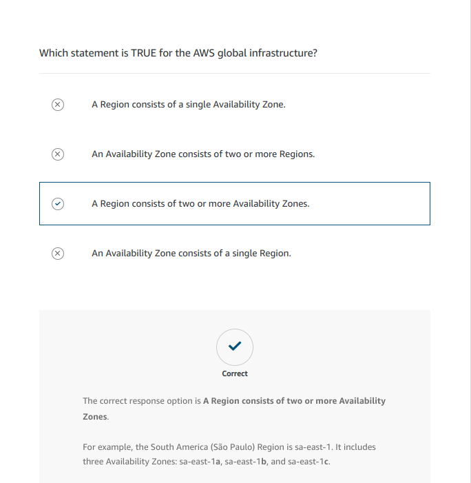
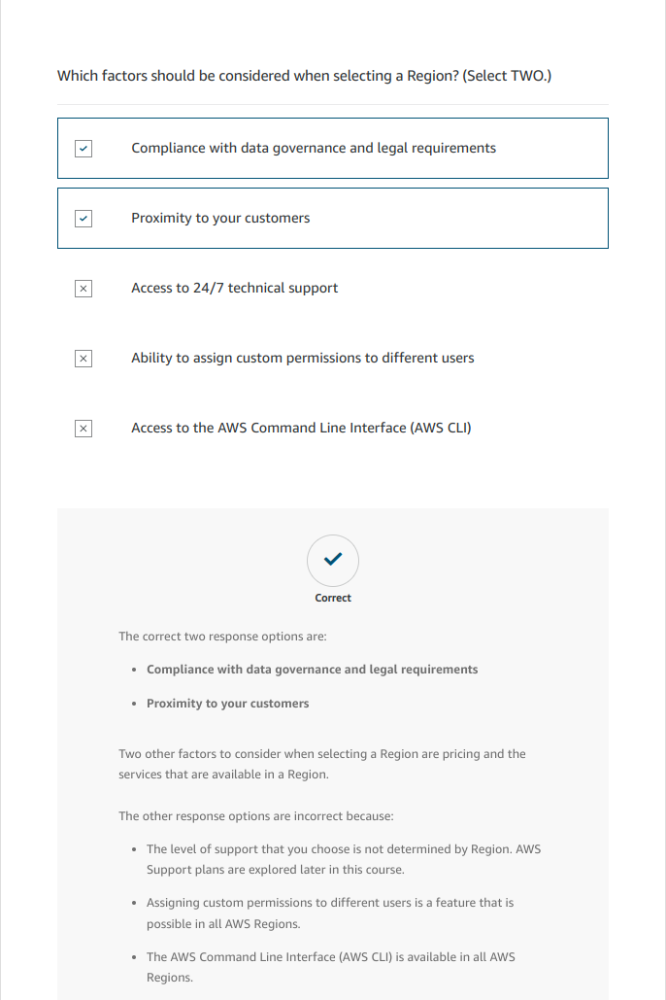
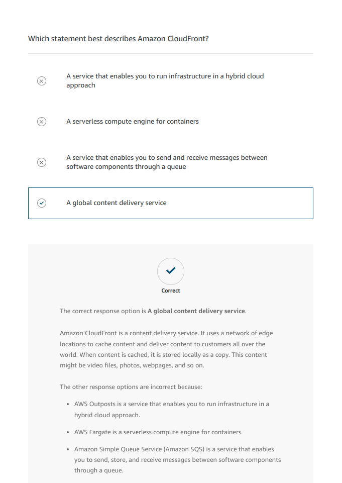
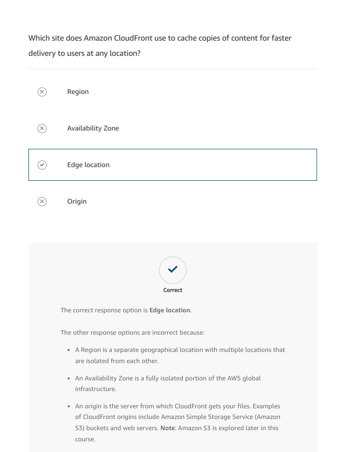
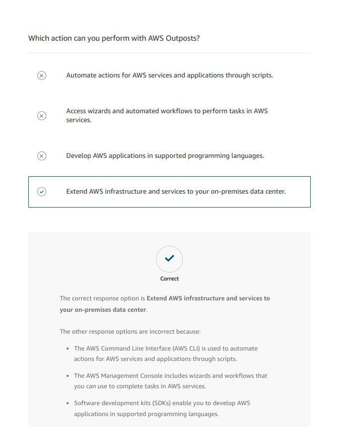

## 2.4 Networking

## 2.5 Storage and Databases

## 2.6 Security

## 2.7 Monitoring and Analytics

## 2.8 Pricing and Support

## 2.9 Migration and Innovation

## 2.10 The Cloud Journey

## 2.11 AWS Certified Cloud Practitioner Basics

---

## 3 - Getting Started with Cloud Acquisition

---

## 4 - AWS Billing and Cost Management

---

## 5 - AWS Well-Architected

---

## 6 - AWS Foundations: Getting Started with the AWS Cloud Essentials
