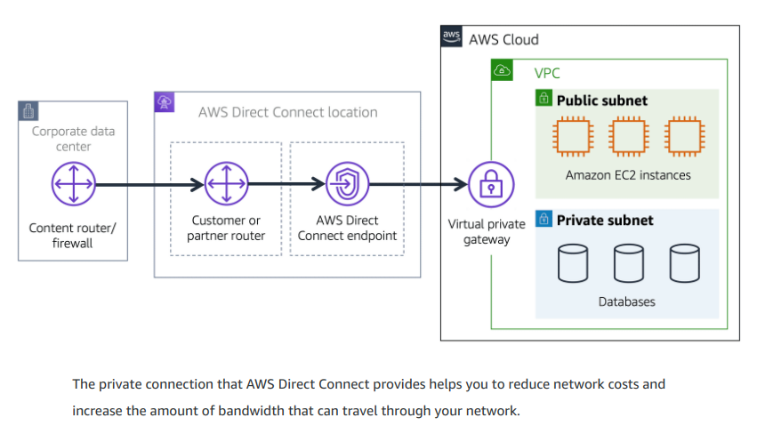
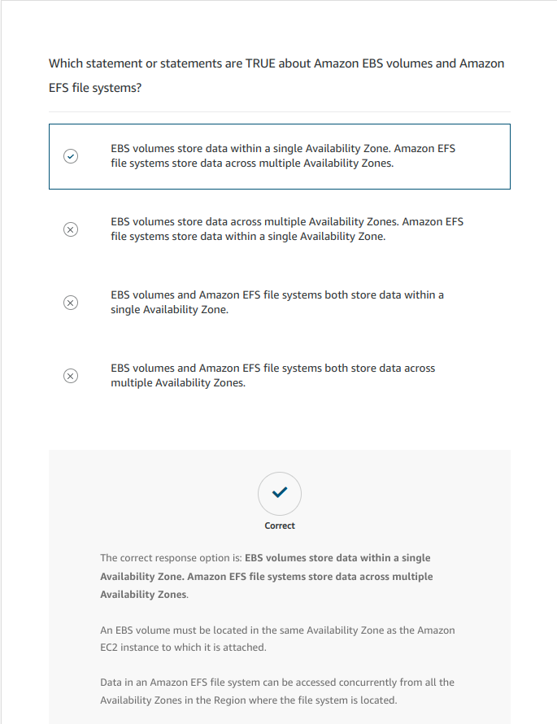
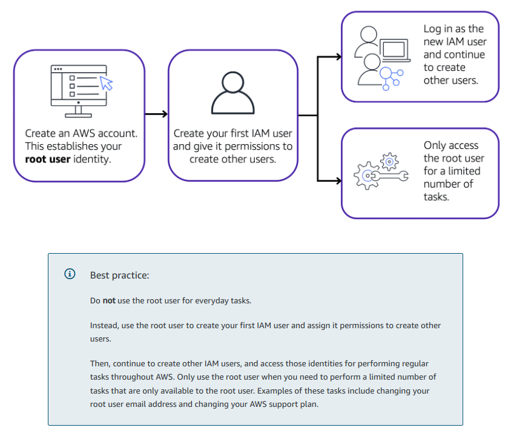
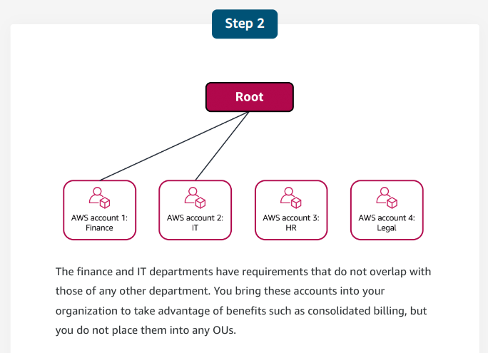
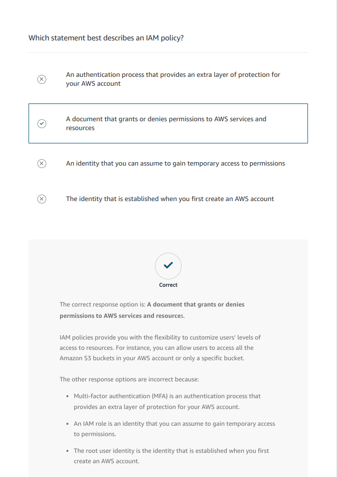
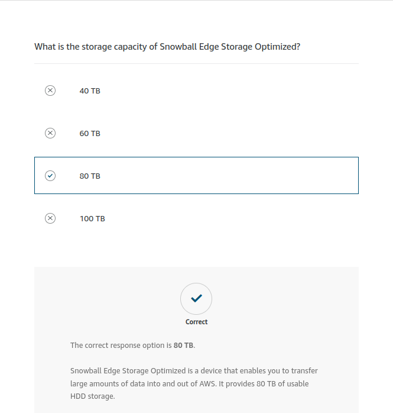
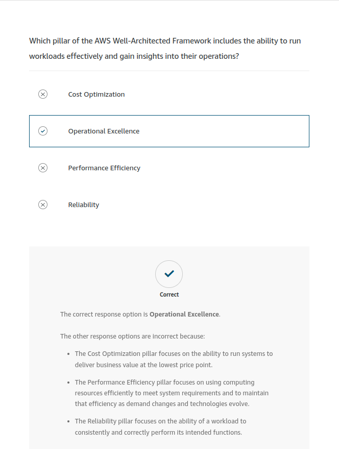

# Cloud Essentials Learning Path

<https://explore.skillbuilder.aws/learn/lp/82/cloud-essentials-learning-plan>

---

## Overview

## [Guide](./media/Ramp-Up_Guide_CloudPractitioner.pdf)

---

## 1 - Job Roles in the Cloud

### 1.1 AWS Cloud for Business

More companies are seeing the value and benefit of moving to a cloud environment.

The traditional on-premises model for managing IT applications and infrastructure is highly manual and often uses expensive equipment at less than full capacity. In contrast, an AWS Cloud environment helps businesses drive innovation because of its ability to increase development speed and provide near-limitless scale. And the speed, scale, innovation, and productivity benefits help businesses pursue bigger, broader digital opportunities, now and in the future.

Speed: With the AWS Cloud, organizations can experiment with applications and new business models at lower cost and greater speed.

Scale: The AWS Cloud creates opportunities for organizations to scale products almost instantaneously to a broader set of customer segments, geographies, and channels.

Innovation: Using the AWS Cloud means that roles that were once required for on premises will move to a shared responsibility model. This frees up your team to innovate and use technologies such as advanced analytics, the Internet of Things, or IoT, and automation at scale.

Productivity: The adoption of cloud principles such as infrastructure and security as code helps to automate compliance and other routine processes, which speeds up productivity.

The AWS Global Cloud Infrastructure is the most secure, extensive, and reliable cloud platform, offering more than 200 fully featured services from data centers globally. Whether you need to deploy your application workloads across the globe in a single click or you want to build and deploy specific applications closer to your end-users with single-digit millisecond latency, AWS provides you the cloud infrastructure where and when you need it.

### 1.2 On-premises Job Roles

Each organization has a different way to structure their IT department; there is no set rule. Today, you will learn about the critical roles of an on-premises IT department.

#### 1.2.1 IT Solutions Architect

The IT Solutions Architect creates the high-level solutions for business applications, systems, portfolios, infrastructures, or an entire enterprise.

They develop IT services and solutions for companies and organizations and often design and manage communications, security, networking, and storage.

#### 1.2.2 System Administrator

The System Administrator keeps servers operational. They ensure servers meet uptime goals. They are responsible for patching or upgrading operating systems, hardware, and hypervisors. They make sure system backups occur.

#### 1.2.3 Network Administrator

Network Administrators administer network access points. They are concerned with security around personnel access, configurations, and virtual private networks (VPNs).

#### 1.2.4 Desktop Administrator

The Desktop Administrator administers installing and maintaining applications on desktop and laptop computers. They work with the Network Administrator for network and security configurations.

#### 1.2.5 Application Administrator

The Applications Administrator handles web and customer applications. They work with the System Administrator to host and maintain applications on servers. They also partner with the Network Administrator for application access control.

#### 1.2.6 Database Administrator

The Database Administrator administers databases by working with the System Administrator on the servers that the database is on. They work with the Network Administrator for database access control.

### 1.3 Shared Responsibility Model

<https://aws.amazon.com/compliance/shared-responsibility-model/>

**AWS is responsible for security of the cloud and customer is responsible for security in the cloud.**

This shared model can help relieve customers' operational burden

- AWS operates, manages, and controls the components from the host operating system and virtualization layer down to the physical security of the facilities in which the service operates.
- The customer assumes responsibility and management of the guest operating system, including updates and security patches. The customer also assumes responsibility for other associated application software and the configuration of the AWS provided security group firewall.

### 1.4 Job Roles in the Cloud

#### 1.4.1 Cloud Architect

The Cloud Architect is responsible for delivering an overall cloud strategy and is in charge of the entire cloud environment. The Cloud Architect builds a business’s cloud architecture blueprint to deliver highly available, cost-efficient, and scalable cloud environments.

This role supervises deployment in the cloud environment and application architecture for all aspects of the cloud. It is critical that a Cloud Architect is knowledgeable enough to be your business’s AWS Cloud subject matter expert and the go-to for anything related to the cloud.

- Understands how services are connected and the integration of services
- Understands Amazon CloudWatch and logging
- Understands AWS Identity and Access Management (IAM) and the security involved

#### 1.4.2 System Administrator

The System Administrator is responsible for overall performance of cloud systems. They are the glue that keeps systems working together by managing configurations, completing detailed tasks, and assisting Database Administrators with setting up database servers in the cloud.

A System Administrator in the cloud maintains data integrity by deploying, configuring, and monitoring hybrid and cloud solutions instead of infrastructure performance and maintenance.

It’s essential that the System Administrator is adaptable and proficient with configuration management, requirements gathering, deployment planning, and completing detailed hands-on tasks.

- Proficient with hands-on tasks and detailed configuration changes
- Understands configuration management
- Proficient with requirement gathering and translating to deployments

#### 1.4.3 Security Administrator

When using AWS, you gain the control and confidence you need to securely run a business with the most flexible and secure cloud computing environment available today. Going back to our shared responsibility model, security and compliance is a shared responsibility between AWS and the customer. **AWS is responsible for the security of the cloud, which includes protecting the infrastructure that runs all of the services offered in the AWS Cloud. The customer is responsible for security in the cloud. This is the Security Administrator’s primary responsibility.**

A Security Administrator must be someone that is trusted and exceptionally knowledgeable because they are responsible for the overall integrity, confidentiality, and protection of data and resources in the cloud.

This role is a combination of reactive (investigates when security incidents or concerns are reported) and proactive (puts standards and development processes in place to reduce the number of security incidents). While the Security Administrator does not need to know all of the details of cloud operations, they do define security requirements based on their company’s security and regulatory requirements.

To ensure security in the cloud, the Security Administrator must have a deep understanding of security rules and requirements applicable to their unique business. They must be highly resourceful, because it isn’t possible to memorize every rule or regulation. This role communicates these requirements down to engineers and up to decision makers to understand and address security risks.

- Defines security requirements for enterprise-level businesses based on their security and regulatory requirements
- Understands security rules and requirements
- Communicates security rules down to engineers and up to decision makers to understand and address security risk
- Resourceful because it is not possible to memorize all regulatory requirements
- Researches and is resourceful with contacts to determine an answer to address security

#### 1.4.4 DevOps Administrator

The DevOps Administrator optimizes the use of the AWS Cloud. They help businesses operate at a larger, faster scale by managing developers and orchestrating the numerous tools and stages in the pipeline.

This role creates and maintains processes so that teams and developers can follow the model of small, rapid releases. To do this, this role manages the release cycle to ensure that there is enough pipeline to evaluate changes that need to be made, tested, and pushed to production. Additionally, the DevOps Administrator conducts tests and backs out changes if there are issues. They have the ability to quickly roll back changes if something doesn’t work.

Because the DevOps Administrator is responsible for orchestrating the pipeline, this role must be proficient with programming scripting languages, operations, QA, and testing.

- Applies programming scripting languages with proficiency
- Understands and applies QA and testing
- Understands operations and manages developers
- Orchestrates the many tools and stages in the pipeline

### 1.5 Map On-premises Job Roles to Cloud Job Roles

#### 1.5.1 Cloud Architect

This is typically a lateral move for an IT Solutions Architect. Their day-to-day concern changes from on-premises issues with hardware, HVAC, or server upgrades, for example, to a focus on cloud technology. An example of a task for a Cloud Architect might be to assist a System Administrator who needs help with an integration.

#### 1.5.2 DevOps Administrator

DevOps Administrators implement continuous build, integration, deployment, and infrastructure as code. They review and recommend operational improvements. DevOps Administrators also perform application testing and recovery.

A DevOps Administrator in the cloud is no longer as dependent on other teams to complete their release cycles. It is common for an Application Administrator to move into the DevOps role. Database Administrators can also move into this role, but there might be more of a learning curve as they must learn about the data operations pipeline.

DevOps Administrators typically oversee database and developer teams.

### 1.6 Grow AWS Cloud competences

- [AWS Skills Builder](https://explore.skillbuilder.aws/)
- [AWS Skills Center](https://aws.amazon.com/training/skills-centers/)

---

## 2 - AWS Cloud Practitioner Essentials

## 2.1 Introduction to Amazon Web Services

### 2.1.1 Introduction

### 2.1.2 Cloud Computing

**Cloud computing is the on-demand delivery of IT resources over the internet with pay-as-you-go pricing.**

### 2.1.2.1 Deployment models

- Cloud-based deployment
  - Run all parts of the application in the cloud.
  - Migrate existing applications to the cloud.
  - Design and build new applications in the cloud.
- On-premises deployment (a.k.a _private cloud_ deployment)
  - Deploy resources by using virtualization and resource management tools.
  - Increase resource utilization by using application management and virtualization technologies.
- Hybrid deployment
  - Connect cloud-based resources to on-premises infrastructure.
  - Integrate cloud-based resources with legacy IT applications.

### 2.1.2.2 Benefits of Cloud Computing

- **Trade upfront expense for variable expense**
  Upfront expense refers to data centers, physical servers, and other resources that you would need to invest in before using them. Variable expense means you only pay for computing resources you consume instead of investing heavily in data centers and servers before you know how you’re going to use them.
  By taking a cloud computing approach that offers the benefit of variable expense, companies can implement innovative solutions while saving on costs.

- **Stop spending money to run and maintain data centers**
  Computing in data centers often requires you to spend more money and time managing infrastructure and servers.
  A benefit of cloud computing is the ability to focus less on these tasks and more on your applications and customers.

- **Stop guessing capacity**
  With cloud computing, you don’t have to predict how much infrastructure capacity you will need before deploying an application.
  For example, you can launch Amazon EC2 instances when needed, and pay only for the compute time you use. Instead of paying for unused resources or having to deal with limited capacity, you can access only the capacity that you need. You can also scale in or scale out in response to demand.

- **Benefit from massive economies of scale**
  By using cloud computing, you can achieve a lower variable cost than you can get on your own.
  Because usage from hundreds of thousands of customers can aggregate in the cloud, providers, such as AWS, can achieve higher economies of scale. The economy of scale translates into lower pay-as-you-go prices.

- **Increase speed and agility**
  The flexibility of cloud computing makes it easier for you to develop and deploy applications.
  This flexibility provides you with more time to experiment and innovate. When computing in data centers, it may take weeks to obtain new resources that you need. By comparison, cloud computing enables you to access new resources within minutes.

- **Go global in minutes**
  The global footprint of the AWS Cloud enables you to deploy applications to customers around the world quickly, while providing them with low latency. This means that even if you are located in a different part of the world than your customers, customers are able to access your applications with minimal delays.

### 2.1.3 Quiz

## 2.2 [Compute in the Cloud](https://aws.amazon.com/products/compute)

### 2.2.1 Introduction

1. First, you launch an instance. Begin by selecting a template with basic configurations for your instance. These configurations include the operating system, application server, or applications. You also select the instance type, which is the specific hardware configuration of your instance.
2. Next, connect to the instance. You can connect to the instance in several ways. Your programs and applications have multiple different methods to connect directly to the instance and exchange data. Users can also connect to the instance by logging in and accessing the computer desktop.
3. After you have connected to the instance, you can begin using it. You can run commands to install software, add storage, copy and organize files, and more.

### 2.2.2 [Amazon EC2 Instance Types](https://aws.amazon.com/ec2/instance-types/)

- **General Purpose Instances**
  Suppose that you have an application in which the resource needs for compute, memory, and networking are roughly equivalent. You might consider running it on a general purpose instance because the application does not require optimization in any single resource area.
  provide a balance of compute, memory, and networking resources. You can use them for a variety of workloads, such as:

  - application servers
  - gaming servers
  - backend servers for enterprise applications
  - small and medium databases

- **Compute Optimized Instances**
  are ideal for compute-bound applications that benefit from high-performance processors. Like general purpose instances, you can use compute optimized instances for workloads such as web, application, and gaming servers.
  However, the difference is compute optimized applications are ideal for high-performance web servers, compute-intensive applications servers, and dedicated gaming servers. You can also use compute optimized instances for batch processing workloads that require processing many transactions in a single group.

- **Memory Optimized Instances**
  are designed to deliver fast performance for workloads that process large datasets in memory. In computing, memory is a temporary storage area. It holds all the data and instructions that a central processing unit (CPU) needs to be able to complete actions. Before a computer program or application is able to run, it is loaded from storage into memory. This preloading process gives the CPU direct access to the computer program.
  Suppose that you have a workload that requires large amounts of data to be preloaded before running an application. This scenario might be a high-performance database or a workload that involves performing real-time processing of a large amount of unstructured data. In these types of use cases, consider using a memory optimized instance. Memory optimized instances enable you to run workloads with high memory needs and receive great performance.

- **Accelerated Computing Instances**
  use hardware accelerators, or coprocessors, to perform some functions more efficiently than is possible in software running on CPUs. Examples of these functions include floating-point number calculations, graphics processing, and data pattern matching.
  In computing, a hardware accelerator is a component that can expedite data processing. Accelerated computing instances are ideal for workloads such as graphics applications, game streaming, and application streaming.

- **Storage Optimized Instances**
  re designed for workloads that require high, sequential read and write access to large datasets on local storage. Examples of workloads suitable for storage optimized instances include distributed file systems, data warehousing applications, and high-frequency online transaction processing (OLTP) systems.
  In computing, the term input/output operations per second (IOPS) is a metric that measures the performance of a storage device. It indicates how many different input or output operations a device can perform in one second. Storage optimized instances are designed to deliver tens of thousands of low-latency, random IOPS to applications.
  You can think of input operations as data put into a system, such as records entered into a database. An output operation is data generated by a server. An example of output might be the analytics performed on the records in a database. If you have an application that has a high IOPS requirement, a storage optimized instance can provide better performance over other instance types not optimized for this kind of use case.

#### 2.2.2.1 Knowledge Check

### 2.2.3 Amazon Ec2 pricing

- **On-demand**
  Ideal for short-term, irregular workloads that cannot be interrupted. No upfront costs or minimum contracts apply. The instances run continuously until you stop them, and you pay for only the compute time you use.
  Sample use cases for On-Demand Instances include developing and testing applications and running applications that have unpredictable usage patterns. On-Demand Instances are not recommended for workloads that last a year or longer because these workloads can experience greater cost savings using Reserved Instances.

- **EC2 Savings Plans**
  AWS offers Savings Plans for several compute services, including Amazon EC2. Amazon EC2 Savings Plans enable you to reduce your compute costs by committing to a consistent amount of compute usage for a 1-year or 3-year term. This term commitment results in savings of up to 72% over On-Demand costs.
  Any usage up to the commitment is charged at the discounted Savings Plan rate (for example, $10 an hour). Any usage beyond the commitment is charged at regular On-Demand rates.
  Later in this course, you will review AWS Cost Explorer, a tool that enables you to visualize, understand, and manage your AWS costs and usage over time. If you are considering your options for Savings Plans, AWS Cost Explorer can analyze your Amazon EC2 usage over the past 7, 30, or 60 days. AWS Cost Explorer also provides customized recommendations for Savings Plans. These recommendations estimate how much you could save on your monthly Amazon EC2 costs, based on previous Amazon EC2 usage and the hourly commitment amount in a 1-year or 3-year Savings Plan.

- **Reserved Instances**
  A billing discount applied to the use of On-Demand Instances in your account. You can purchase Standard Reserved and Convertible Reserved Instances for a 1-year or 3-year term, and Scheduled Reserved Instances for a 1-year term. You realize greater cost savings with the 3-year option.
  At the end of a Reserved Instance term, you can continue using the Amazon EC2 instance without interruption. However, you are charged On-Demand rates until you do one of the following:

  - Terminate the instance.
  - Purchase a new Reserved Instance that matches the instance attributes (instance type, Region, tenancy, and platform).

- **Spot Instances**
  Ideal for workloads with flexible start and end times, or that can withstand interruptions. Spot Instances use unused Amazon EC2 computing capacity and offer you cost savings at up to 90% off of On-Demand prices.
  Suppose that you have a background processing job that can start and stop as needed (such as the data processing job for a customer survey). You want to start and stop the processing job without affecting the overall operations of your business. If you make a Spot request and Amazon EC2 capacity is available, your Spot Instance launches. However, if you make a Spot request and Amazon EC2 capacity is unavailable, the request is not successful until capacity becomes available. The unavailable capacity might delay the launch of your background processing job.
  After you have launched a Spot Instance, if capacity is no longer available or demand for Spot Instances increases, your instance may be interrupted. This might not pose any issues for your background processing job. However, in the earlier example of developing and testing applications, you would most likely want to avoid unexpected interruptions. Therefore, choose a different EC2 instance type that is ideal for those tasks.

- **Dedicated Hosts**
  Physical servers with Amazon EC2 instance capacity that is fully dedicated to your use.
  You can use your existing per-socket, per-core, or per-VM software licenses to help maintain license compliance. You can purchase On-Demand Dedicated Hosts and Dedicated Hosts Reservations. Of all the Amazon EC2 options that were covered, Dedicated Hosts are the most expensive.

### 2.2.4 Scaling Amazon Ec2

#### 2.2.4.1 Scalability

involves beginning with only the resources you need and designing your architecture to automatically respond to changing demand by scaling out or in. As a result, you pay for only the resources you use. You don’t have to worry about a lack of computing capacity to meet your customers’ needs.

#### 2.2.4.2 Amazon EC2 Auto Scaling

### 2.2.5 Directing traffic with Elastic Load Balancing

**Regional Construct**

### 2.2.6 Messaging and Queueing

#### 2.2.6.1 Amazon Simple Notification Service (SNS)

- is a publish/subscribe service. Using Amazon SNS topics, a publisher publishes messages to subscribers.
- In Amazon SNS, subscribers can be web servers, email addresses, AWS Lambda functions, or several other options.

#### 2.2.6.2 Amazon Simple Queue Service (SQS)

For decoupled applications and microservices, Amazon SQS enables you to send, store, and retrieve messages between components.
This decoupled approach enables the separate components to work more efficiently and independently.

- you can send, store, and receive messages between software components, without losing messages or requiring other services to be available.
- In Amazon SQS, an application sends messages into a queue.
- A user or service retrieves a message from the queue, processes it, and then deletes it from the queue.

#### 2.2.6.3 Quiz

### 2.2.7 Additional Compute Services

#### 2.2.7.1 Serverless Computing

The term “serverless” means that your code runs on servers, but you do not need to provision or manage these servers. With serverless computing, you can focus more on innovating new products and features instead of maintaining servers.

Another benefit of serverless computing is the flexibility to scale serverless applications automatically. Serverless computing can adjust the applications' capacity by modifying the units of consumptions, such as throughput and memory.

#### 2.2.7.2 [AWS Lambda](https://aws.amazon.com/lambda)

Service that lets you run code without needing to provision or manage servers.

While using AWS Lambda, you pay only for the compute time that you consume. Charges apply only when your code is running. You can also run code for virtually any type of application or backend service, all with zero administration.

For example, a simple Lambda function might involve automatically resizing uploaded images to the AWS Cloud. In this case, the function triggers when uploading a new image.

#### 2.2.7.3 Containers

Provide you with a standard way to package your application's code and dependencies into a single object.

You can also use containers for processes and workflows in which there are essential requirements for security, reliability, and scalability.

Container orchestration services help you to deploy, manage, and scale your containerized applications.

#### 2.2.7.4 Amazon Elastic Container Service ([Amazon ECS](https://aws.amazon.com/ecs/))

Highly scalable, high-performance container management system that enables you to run and scale containerized applications on AWS.

Amazon ECS supports Docker containers. [Docker](https://www.docker.com/) is a software platform that enables you to build, test, and deploy applications quickly. AWS supports the use of open-source Docker Community Edition and subscription-based Docker Enterprise Edition. With Amazon ECS, you can use API calls to launch and stop Docker-enabled applications.

#### 2.2.7.5 Amazon Elastic Kubernetes Service ([Amazon EKS](https://aws.amazon.com/eks/))

Fully managed service that you can use to run Kubernetes on AWS.

[Kubernetes](https://kubernetes.io/) is open-source software that enables you to deploy and manage containerized applications at scale. A large community of volunteers maintains Kubernetes, and AWS actively works together with the Kubernetes community. As new features and functionalities release for Kubernetes applications, you can easily apply these updates to your applications managed by Amazon EKS.

#### 2.2.7.6 [AWS Fargate](https://aws.amazon.com/fargate/)

Serverless compute engine for containers. It works with both Amazon ECS and Amazon EKS.

When using AWS Fargate, you do not need to provision or manage servers. AWS Fargate manages your server infrastructure for you. You can focus more on innovating and developing your applications, and you pay only for the resources that are required to run your containers.

### 2.2.8 Summary

**What is cloud computing and what does AWS offer?**

- We define cloud computing as the on-demand delivery of IT resources over the internet with pay-as-you-go pricing. This means that you can make requests for IT resources like compute, networking, storage, analytics, or other types of resources, and then they're made available for you on demand. You don't pay for the resource upfront. Instead, you just provision and pay at the end of the month.

AWS offers services and many categories that you use together to create your solutions.
We've only covered a few services so far, you learned about **Amazon EC2**.

- With EC2, you can dynamically spin up and spin down virtual servers called EC2 instances.
- When you launch an EC2 instance, you choose the instance family.
- The instance family determines the hardware the instance runs on.
- And you can have instances that are built for your specific purpose:
  - general purpose,
  - compute optimized,
  - memory optimized,
  - accelerated computing,
  - storage optimized.
- You can scale your EC2 instances either
  - vertically by resizing the instance,
  - or horizontally by launching new instances and adding them to the pool.
  - You can set up automated horizontal scaling, using Amazon EC2 Auto Scaling.
- EC2 instances have different pricing models:
  - On-Demand, which is the most flexible and has no contract,
  - Spot pricing, which allows you to utilize unused capacity at a discounted rate,
  - Dedicated Hosts or Reserved Instances, which allow you to enter into a contract with AWS to get a discounted rate when you commit to a certain level of usage,
  - Savings Plans which apply to AWS Lambda, and AWS Fargate, as well as EC2 instances.

Once you've scaled your EC2 instances out horizontally, you need something to distribute the incoming traffic across those instances.
This is where the **Elastic Load Balancer** comes into play.

We also covered messaging services:

- There is **Amazon Simple Queue Service or SQS**. This service allows you to decouple system components. Messages remain in the queue until they are either consumed or deleted.
- **Amazon Simple Notification Service or SNS**, is used for sending messages like emails, text messages, push notifications, or even HTTP requests. Once a message is published, it is sent to all of these subscribers.

There are container services like **Amazon Elastic Container Service, or ECS**.
And there's **Amazon Elastic Kubernetes Service, or EKS**.
Both of which are container orchestration tools. You can use these tools with EC2 instances, but if you don't want to manage that, you don't need to.
You can use **AWS Fargate**, which allows you to run your containers on top of a serverless compute platform.

Then there is **AWS Lambda**, which allows you to just upload your code, and configure it to run based on triggers.
And you only get charged for when the code is actually running. No containers, no virtual machines. Just code and configuration.

### 2.2.9 Quiz

## 2.3 Global Infrastructure and Reliability

### 2.3.1 Introduction

Learning Objectives:

- Summarize the benefits of the AWS Global Infrastructure.
- Describe the basic concept of Availability Zones.
- Describe the benefits of Amazon CloudFront and edge locations.
- Compare different methods for provisioning AWS services

### 2.3.2 AWS Global Infrastructure

#### 2.3.2.1 Regions

When determining the right Region for your services, data, and applications, consider the following four business factors.

- **Compliance with data governance and legal requirements**
  Depending on your company and location, you might need to run your data out of specific areas.
  For example, if your company requires all of its data to reside within the boundaries of the UK, you would choose the London Region.

  Not all companies have location-specific data regulations, so you might need to focus more on the other three factors.

- **Proximity to your customers**
  Selecting a Region that is close to your customers will help you to get content to them faster.
  For example, your company is based in Washington, DC, and many of your customers live in Singapore.
  You might consider running your infrastructure in the Northern Virginia Region to be close to company headquarters, and run your applications from the Singapore Region.

- **Available services within a Region**
  Sometimes, the closest Region might not have all the features that you want to offer to customers.
  AWS is frequently innovating by creating new services and expanding on features within existing services.
  However, making new services available around the world sometimes requires AWS to build out physical hardware one Region at a time.

  Suppose that your developers want to build an application that uses Amazon Braket (AWS quantum computing platform).
  Amazon Braket is not yet available in every AWS Region around the world, so your developers would have to run it in one of the Regions that already offers it.

- **Pricing**
  Suppose that you are considering running applications in both the United States and Brazil.
  The way Brazil’s tax structure is set up, it might cost 50% more to run the same workload out of the São Paulo Region compared to the Oregon Region.
  You will learn in more detail that several factors determine pricing, but for now know that the cost of services can vary from Region to Region.

#### 2.3.2.2 Availability Zones

- Single data center or a group of data centers within a Region.
- Availability Zones are located tens of miles apart from each other.
- This is close enough to have low latency (the time between when content requested and received) between Availability Zones.
- However, if a disaster occurs in one part of the Region, they are distant enough to reduce the chance that multiple Availability Zones are affected.

Planning for failure and deploying applications across multiple Availability Zones is an important part of building a resilient and highly available architecture.

#### 2.3.2.3 Knowledge Check

### 2.3.3 Edge Locations

#### 2.3.3.1 Amazon CloudFront (Content Delivery Network - CDN)

- Service that helps deliver data, video, applications, and APIs to customers around the world with low latency and high transfer speeds.
- Amazon CloudFront uses what are called Edge locations, all around the world, to help accelerate communication with users, no matter where they are.

#### 2.3.3.2 Edge Locations

- Are separate from Regions, so you can push content from inside a Region to a collection of Edge locations around the world, in order to accelerate communication and content delivery.
- Also run a **DNS Service Amazon Route 53** helping direct customers to the correct web locations with reliably low latency.

#### 2.3.3.3 AWS Outposts

- AWS will basically install a fully operational mini Region, right inside your own data center.
- That's owned and operated by AWS, using 100% of AWS functionality, but isolated within your own building.

### 2.3.4 How to provision AWS resources

#### 2.3.4.1 Ways to interact with AWS Services

In AWS, **everything is an API call**.

- **AWS Management Console**
  Web-based interface for accessing and managing AWS services. You can quickly access recently used services and search for other services by name, keyword, or acronym.
  The console includes wizards and automated workflows that can simplify the process of completing tasks.

  You can also use the AWS Console mobile application to perform tasks such as monitoring resources, viewing alarms, and accessing billing information.
  Multiple identities can stay logged into the AWS Console mobile app at the same time.

- **AWS Command Line Interface (CLI)**
  To save time when making API requests, you can use the AWS Command Line Interface (AWS CLI).
  AWS CLI enables you to control multiple AWS services directly from the command line within one tool.
  AWS CLI is available for users on Windows, macOS, and Linux.

  By using AWS CLI, you can automate the actions that your services and applications perform through scripts.
  For example, you can use commands to launch an Amazon EC2 instance, connect an Amazon EC2 instance to a specific Auto Scaling group, and more.

- **Software Development Kits (SDKs)**
  SDKs make it easier for you to use AWS services through an API designed for your programming language or platform.
  SDKs enable you to use AWS services with your existing applications or create entirely new applications that will run on AWS.

#### 2.3.4.2 AWS Elastic Beanstalk

Service that helps you provision Amazon EC2-based environments
With AWS Elastic Beanstalk, you provide code and configuration settings, and Elastic Beanstalk deploys the resources necessary to perform the following tasks:

- Adjust capacity
- Load balancing
- Automatic scaling
- Application health monitoring

#### 2.3.4.3 AWS CloudFormation

With AWS CloudFormation, you can treat your infrastructure as code. This means that you can build an environment by writing lines of code instead of using the AWS Management Console to individually provision resources.

AWS CloudFormation provisions your resources in a safe, repeatable manner, enabling you to frequently build your infrastructure and applications without having to perform manual actions. It determines the right operations to perform when managing your stack and rolls back changes automatically if it detects errors.

### 2.3.5 Summary

How logical clusters of data centers make up Availability Zones.
Availability Zones in turn make up Regions, and those are spread globally.
You then choose what Regions and Availability Zones you want to operate out of and as a best practice, you should always deploy infrastructure across at least two Availability Zones.
Some AWS services like Elastic Load Balancing, Amazon SQS, and Amazon SNS already do this for you.

Edge locations: how you can deploy content there to speed up delivery to your customers.
We even touched upon edge devices like AWS Outposts which allow you to run AWS infrastructure right in your own data center.

Another thing we discussed was how to provision AWS resources through various options, such as:

- the AWS Management Console,
- the SDK,
- CLI,
- AWS Elastic Beanstalk,
- AWS CloudFormation, where you learned how you can set up your infrastructure as code.

### 2.3.6 Quiz

## 2.4 Networking

### 2.4.1 Connectivity to AWS

#### 2.4.1.1 Amazon Virtual Private Cloud ([Amazon VPC](https://aws.amazon.com/vpc/))

Enables you to provision an isolated section of the AWS Cloud.
In this isolated section, you can launch resources in a virtual network that you define.
Within a virtual private cloud (VPC), you can organize your resources into subnets.
A subnet is a section of a VPC that can contain resources such as Amazon EC2 instances.

#### 2.4.1.2 Internet Gateway

To allow public traffic from the internet to access your VPC, you attach an internet gateway to the VPC.

#### 2.4.1.3 Virtual Private Gateway

What if you have a VPC that includes only private resources?
To access private resources in a VPC, you can use a virtual private gateway.
You can think of the internet as the road between your home and the coffee shop.
Suppose that you are traveling on this road with a bodyguard to protect you.
You are still using the same road as other customers, but with an extra layer of protection.

The bodyguard is like a virtual private network (VPN) connection that encrypts (or protects) your internet traffic from all the other requests around it.

The virtual private gateway is the component that allows protected internet traffic to enter into the VPC.
Even though your connection to the coffee shop has extra protection, traffic jams are possible because you’re using the same road as other customers.

#### 2.4.1.4 [AWS Direct Connect](https://aws.amazon.com/directconnect/)

Service that enables you to establish a dedicated private connection between your data center and a VPC.

### 2.4.2 Subnets and Network Access Control Lists

#### 2.4.2.1 Subnets

A subnet is a section of a VPC in which you can group resources based on security or operational needs.
Subnets can be public or private.

#### 2.4.2.2 Network Traffic in a VPC

When a customer requests data from an application hosted in the AWS Cloud, this request is sent as a packet.
A packet is a unit of data sent over the internet or a network.
It enters into a VPC through an internet gateway.
Before a packet can enter into a subnet or exit from a subnet, it checks for permissions.
These permissions indicate who sent the packet and how the packet is trying to communicate with the resources in a subnet.

#### 2.4.2.3 Network Access Control Lists ([ACL](https://docs.aws.amazon.com/vpc/latest/userguide/vpc-network-acls.html))

Virtual firewall that controls inbound and outbound traffic at the subnet level.

#### 2.4.2.4 Stateless Packet Filtering

**Network ACLs** perform **stateless** packet filtering.
They remember nothing and check packets that cross the subnet border each way: inbound and outbound.
When a packet response for that request comes back to the subnet, the network ACL does not remember your previous request.
The network ACL checks the packet response against its list of rules to determine whether to allow or deny.

#### 2.4.2.5 [Security Groups](https://docs.aws.amazon.com/vpc/latest/userguide/VPC_SecurityGroups.html)

Virtual firewall that controls inbound and outbound traffic for an Amazon EC2 instance.

#### 2.4.2.6 Stateful Packet Filtering

**Security groups** perform **stateful** packet filtering.
They remember previous decisions made for incoming packets.
When a packet response for that request returns to the instance, the security group remembers your previous request.
The security group allows the response to proceed, regardless of inbound security group rules.

#### 2.4.2.7 Knowledge Check

### 2.4.3 Global Networking

#### 2.4.3.1 Domain Name System (DNS)

You can think of DNS as being the phone book of the internet.
DNS resolution is the process of translating a domain name to an IP address.

#### 2.4.3.2 [Amazon Route 53](https://aws.amazon.com/route53)

DNS web service.
It gives developers and businesses a reliable way to route end users to internet applications hosted in AWS.

Amazon Route 53 connects user requests to infrastructure running in AWS (such as Amazon EC2 instances and load balancers).
It can route users to infrastructure outside of AWS.

Another feature of Route 53 is the ability to manage the DNS records for domain names.
You can register new domain names directly in Route 53.
You can also transfer DNS records for existing domain names managed by other domain registrars.
This enables you to manage all of your domain names within a single location.

#### 2.4.3.3 Knowledge Check

### 2.4.4 Quiz

## 2.5 Storage and Databases

### 2.5.1 Instance Stores and Amazon Elastic Blocks Store (Amazon EBS)

#### 2.5.1.1 [Instance Stores](https://docs.aws.amazon.com/AWSEC2/latest/UserGuide/InstanceStorage.html)

Provides temporary block-level storage for an Amazon EC2 instance.
An instance store is disk storage that is physically attached to the host computer for an EC2 instance, and therefore has the same lifespan as the instance.
When the instance is terminated, you lose any data in the instance store.
If you start an instance from a stopped state, the instance might start on another host, where the previously used instance store volume does not exist.
Therefore, AWS recommends instance stores for use cases that involve temporary data that you do not need in the long term.

#### 2.5.1.2 Amazon Elastic Block Store ([AmazonEBS](https://aws.amazon.com/ebs))

Service that provides block-level storage volumes that you can use with Amazon EC2 instances.
If you stop or terminate an Amazon EC2 instance, all the data on the attached EBS volume remains available.

To create an EBS volume, you define the configuration (such as volume size and type) and provision it.
After you create an EBS volume, it can attach to an Amazon EC2 instance.

- Sizes up to 16 TiB
- Solid State by default
- HDD options

#### 2.5.1.3 [Amazon EBS snapshots](https://docs.aws.amazon.com/AWSEC2/latest/UserGuide/EBSSnapshots.html)

Because EBS volumes are for data that needs to persist, it’s important to back up the data.
You can take incremental backups of EBS volumes by creating Amazon EBS snapshots.
This means that the first backup taken of a volume copies all the data.
For subsequent backups, only the blocks of data that have changed since the most recent snapshot are saved.

Incremental backups are different from full backups, in which all the data in a storage volume copies each time a backup occurs.
The full backup includes data that has not changed since the most recent backup.

### 2.5.2 Amazon Simple Storage Service (Amazon S3)

#### 2.5.2.1 Object Storage

Each object consists of:

- Data
- Metadata
- Key

Recall that when you modify a file in block storage, only the pieces that are changed are updated. When a file in object storage is modified, the entire object is updated.

#### 2.5.2.2 Amazon Simple Storage Service ([Amazon S3](https://aws.amazon.com/s3/))

Service that provides object-level storage.
Amazon S3 stores data as objects in buckets.
You can upload any type of file to Amazon S3, such as images, videos, text files, and so on.
For example, you might use Amazon S3 to store backup files, media files for a website, or archived documents.
Amazon S3 offers unlimited storage space.
The maximum file size for an object in Amazon S3 is 5 TB.

When you upload a file to Amazon S3, you can set permissions to control visibility and access to it.
You can also use the Amazon S3 versioning feature to track changes to your objects over time.

#### 2.5.2.3 [Amazon S3 Storage Classes](https://aws.amazon.com/s3/storage-classes)

Factors:

- How often you plan to retrieve your data
- How available you need your data to be

Classes:

- **Amazon S3 Standard**

  - Designed for frequently accessed data
  - Stores data in a minimum of three Availability Zones
  - Provides high availability for objects
  - use cases:
    - websites
    - content distribution
    - data analytics
  - has a higher cost than other storage classes intended for infrequently accessed data and archival storage

- **Amazon S3 Standard-Infrequent Access (S3 Standard-IA)**

  - Ideal for infrequently accessed data
  - Similar to Amazon S3 Standard but has a lower storage price and higher retrieval price
  - ideal for data infrequently accessed but requires high availability when needed
  - Stores data in a minimum of three Availability Zones

- **Amazon S3 One Zone-Infrequent Access (S3 One Zone-IA)**

  - Stores data in a single Availability Zone
  - Has a lower storage price than Amazon S3 Standard-IA
  - You want to save costs on storage.
  - You can easily reproduce your data in the event of an Availability Zone failure.

- **Amazon S3 Intelligent-Tiering**

  - Ideal for data with unknown or changing access patterns
  - Requires a small monthly monitoring and automation fee per object
  - If you haven’t accessed an object for 30 consecutive days, Amazon S3 automatically moves it to the infrequent access tier, Amazon S3 Standard-IA
  - If you access an object in the infrequent access tier, Amazon S3 automatically moves it to the frequent access tier, Amazon S3 Standard

- **Amazon S3 Glacier Instant Retrieval**

  - Works well for archived data that requires immediate access
  - Can retrieve objects within a few milliseconds

- **Amazon S3 Glacier Flexible Retrieval**

  - Low-cost storage designed for data archiving
  - Able to retrieve objects within a few minutes to hours

- **Amazon S3 Glacier Deep Archive**

  - Lowest-cost object storage class ideal for archiving
  - Able to retrieve objects within 12 hours
  - long-term retention and digital preservation for data that might be accessed once or twice in a year
  - objects from this storage class are replicated and stored across at least three geographically dispersed Availability Zones

- **Amazon S3 Outposts**

  - Creates S3 buckets on Amazon S3 Outposts
  - Makes it easier to retrieve, store, and access data on AWS Outposts
  - delivers object storage to your on-premises AWS Outposts environment
  - designed to store data durably and redundantly across multiple devices and servers on your Outposts
  - workloads with local data residency requirements that must satisfy demanding performance needs by keeping data close to on-premises applications

#### 2.5.2.4 Knowledge Check

### 2.5.3 Amazon Elastic File System (Amazon EFS)

#### 2.5.3.1 File Storage

Multiple clients (such as users, applications, servers, and so on) can access data that is stored in shared file folders.
In this approach, a storage server uses block storage with a local file system to organize files.
Clients access data through file paths.

File storage is ideal for use cases in which a large number of services and resources need to access the same data at the same time.

#### 2.5.3.2 Amazon Elastic File System ([Amazon EFS](https://aws.amazon.com/efs/))

Scalable file system used with AWS Cloud services and on-premises resources.
As you add and remove files, Amazon EFS grows and shrinks automatically.
It can scale on demand to petabytes without disrupting applications.

#### 2.5.3.3 Comparing Amazon EBS and Amazon EFS

### 2.5.4 Amazon Relational Database Service (Amazon RDS)

#### 2.5.4.1 Relational Databases

Data is stored in a way that relates it to other pieces of data.
Relational databases use structured query language (SQL) to store and query data.
This approach allows data to be stored in an easily understandable, consistent, and scalable way.

#### 2.5.4.2 Amazon Relational Database Services ([Amazon RDS](https://aws.amazon.com/rds/))

Service that enables you to run relational databases in the AWS Cloud.
Amazon RDS is a managed service that automates tasks such as hardware provisioning, database setup, patching, and backups.
With these capabilities, you can spend less time completing administrative tasks and more time using data to innovate your applications.
You can integrate Amazon RDS with other services to fulfill your business and operational needs, such as using AWS Lambda to query your database from a serverless application.

Amazon RDS provides a number of different security options.
Many Amazon RDS database engines offer:

- encryption at rest (protecting data while it is stored)
- encryption in transit (protecting data while it is being sent and received).

#### 2.5.4.3 Amazon RDS database engines

- Amazon Aurora
- PostgreSQL
- MySQL
- MariaDB
- Oracle Database
- Microsoft SQL Server

#### 2.5.4.4 [Amazon Aurora](https://aws.amazon.com/rds/aurora/)

Enterprise-class relational database.
It is compatible with MySQL and PostgreSQL relational databases.
It is up to five times faster than standard MySQL databases and up to three times faster than standard PostgreSQL databases.

Amazon Aurora helps to reduce your database costs by reducing unnecessary input/output (I/O) operations, while ensuring that your database resources remain reliable and available.

Consider Amazon Aurora if your workloads require high availability.
It replicates six copies of your data across three Availability Zones and continuously backs up your data to Amazon S3.

### 2.5.5 Amazon DynamoDB

#### 2.5.5.1 Nonrelational databases

A table is a place where you can store and query data.

Nonrelational databases are sometimes referred to as “NoSQL databases” because they use structures other than rows and columns to organize data.
One type of structural approach for nonrelational databases is key-value pairs.
With key-value pairs, data is organized into items (keys), and items have attributes (values).
You can think of attributes as being different features of your data.

In a key-value database, you can add or remove attributes from items in the table at any time.
Additionally, not every item in the table has to have the same attributes.

#### 2.5.5.2 [Amazon DynamoDB](https://aws.amazon.com/dynamodb/)

Key-value database service.
It delivers single-digit millisecond performance at any scale.

- Serverless
- Automatic Scaling

#### 2.5.5.3 Knowledge Check

### 2.5.6 [Amazon Redshift](https://aws.amazon.com/redshift)

Data warehousing service that you can use for big data analytics.
It offers the ability to collect data from many sources and helps you to understand relationships and trends across your data.

### 2.5.7 Amazon Database Migration Service ([AWS DMS](https://aws.amazon.com/dms/))

Enables you to migrate relational databases, nonrelational databases, and other types of data stores.

With AWS DMS, you move data between a source database and a target database.
The source and target databases can be of:

- Homogeneous: the same type
- Heterogenous: different types (schema conversion tool must be used prior to migration)

During the migration, your source database remains operational, reducing downtime for any applications that rely on the database.

For example, suppose that you have a MySQL database that is stored on premises in an Amazon EC2 instance or in Amazon RDS.
Consider the MySQL database to be your source database.
Using AWS DMS, you could migrate your data to a target database, such as an Amazon Aurora database.

Use cases:

- Development and test database migrations
  - Enabling developers to test applications against production data without affecting production users
- Database consolidation
  - Combining several databases into a single database
- Continuous replication
  - Sending ongoing copies of your data to other target sources instead of doing a one-time migration

### 2.5.8 Additional Database Services

### 2.5.8.1 [Amazon DocumentDB](https://aws.amazon.com/documentdb)

Document database service that supports MongoDB workloads

### 2.5.8.2 [Amazon Neptune](https://aws.amazon.com/neptune)

Graph database service.

You can use Amazon Neptune to build and run applications that work with highly connected datasets, such as:

- recommendation engines
- fraud detection
- knowledge graphs

### 2.5.8.1 Amazon Quantum Ledger Database ([Amazon QLDB](https://aws.amazon.com/qldb))

Ledger database service.
You can use Amazon QLDB to review a complete history of all the changes that have been made to your application data.

### 2.5.8.1 [Amazon Managed Blockchain](https://aws.amazon.com/managed-blockchain)

Service that you can use to create and manage blockchain networks with open-source frameworks.
Blockchain is a distributed ledger system that lets multiple parties run transactions and share data without a central authority.

### 2.5.8.1 [Amazon ElasticCache](https://aws.amazon.com/elasticache)

Service that adds caching layers on top of your databases to help improve the read times of common requests.
It supports two types of data stores:

- Redis
- Memcached

### 2.5.8.1 Amazon DynamoDB Accelerator ([DAX](https://aws.amazon.com/dynamodb/dax/))

In-memory cache for DynamoDB.
It helps improve response times from single-digit milliseconds to microseconds.

### 2.5.9 Quiz

## 2.6 Security

### 2.6.1 [Shared Responsibility Model](https://aws.amazon.com/compliance/shared-responsibility-model/)

#### 2.6.1.1 Customer Responsibilities (“security in the cloud”)

Customers are responsible for the security of everything that they create and put in the AWS Cloud.

When using AWS services, you, the customer, maintain complete control over your content.
You are responsible for managing security requirements for your content, including which content you choose to store on AWS, which AWS services you use, and who has access to that content.
You also control how access rights are granted, managed, and revoked.

The security steps that you take will depend on factors such as the services that you use, the complexity of your systems, and your company’s specific operational and security needs.
Steps include selecting, configuring, and patching the operating systems that will run on Amazon EC2 instances, configuring security groups, and managing user accounts.

#### 2.6.1.2 AWS Responsibilities (“security of the cloud”)

AWS operates, manages, and controls the components at all layers of infrastructure.
This includes areas such as the host operating system, the virtualization layer, and even the physical security of the data centers from which services operate.

AWS is responsible for protecting the global infrastructure that runs all of the services offered in the AWS Cloud.
This infrastructure includes AWS Regions, Availability Zones, and edge locations.

AWS manages the security of the cloud, specifically the physical infrastructure that hosts your resources, which include:

- Physical security of data centers
- Hardware and software infrastructure
- Network infrastructure
- Virtualization infrastructure

Although you cannot visit AWS data centers to see this protection firsthand, AWS provides several reports from third-party auditors. These auditors have verified its compliance with a variety of computer security standards and regulations.

#### 2.6.1.3 Knowledge Check

### 2.6.2 User Permission and Access

#### 2.6.2.1 AWS Identity and Access Management ([IAM](https://aws.amazon.com/iam/))

Manage access to AWS services and resources securely.
IAM gives you the flexibility to configure access based on your company’s specific operational and security needs.

#### 2.6.2.2 [AWS account root user](https://docs.aws.amazon.com/IAM/latest/UserGuide/id_root-user.html)

When you first create an AWS account, you begin with an identity known as the root user.

The root user is accessed by signing in with the email address and password that you used to create your AWS account.
You can think of the root user as being similar to the owner of the coffee shop.
It has complete access to all the AWS services and resources in the account.

#### 2.6.2.3 IAM users

An IAM user is an identity that you create in AWS.
It represents the person or application that interacts with AWS services and resources.
It consists of a name and credentials.

By default, when you create a new IAM user in AWS, it has no permissions associated with it.
To allow the IAM user to perform specific actions in AWS, such as launching an Amazon EC2 instance or creating an Amazon S3 bucket, you must grant the IAM user the necessary permissions.

#### 2.6.2.4 IAM policies

An IAM policy is a document that allows or denies permissions to AWS services and resources.

IAM policies enable you to customize users’ levels of access to resources.
For example, you can allow users to access all of the Amazon S3 buckets within your AWS account, or only a specific bucket.

#### 2.6.2.5 [IAM groups](https://docs.aws.amazon.com/IAM/latest/UserGuide/id_groups.html)

An IAM group is a collection of IAM users.
When you assign an IAM policy to a group, all users in the group are granted permissions specified by the policy.

Assigning IAM policies at the group level also makes it easier to adjust permissions when an employee transfers to a different job.
For example, if a cashier becomes an inventory specialist, the coffee shop owner removes them from the “Cashiers” IAM group and adds them into the “Inventory Specialists” IAM group.
This ensures that employees have only the permissions that are required for their current role.

#### 2.6.2.6 [IAM roles](https://docs.aws.amazon.com/IAM/latest/UserGuide/id_roles.html)

An IAM role is an identity that you can assume to gain temporary access to permissions.

When the employee needs to switch to a different task, they give up their access to one workstation and gain access to the next workstation.
The employee can easily switch between workstations, but at any given point in time, they can have access to only a single workstation.
This same concept exists in AWS with IAM roles.

Before an IAM user, application, or service can assume an IAM role, they must be granted permissions to switch to the role.
When someone assumes an IAM role, they abandon all previous permissions that they had under a previous role and assume the permissions of the new role.

#### 2.6.2.7 [Multi-factor authentication](https://aws.amazon.com/iam/features/mfa/)

In IAM, multi-factor authentication (MFA) provides an extra layer of security for your AWS account.

### 2.6.3 [AWS Organizations](https://aws.amazon.com/organizations)

Suppose that your company has multiple AWS accounts.
You can use AWS Organizations to consolidate and manage multiple AWS accounts within a central location.

When you create an organization, AWS Organizations automatically creates a root, which is the parent container for all the accounts in your organization.

In AWS Organizations, you can centrally control permissions for the accounts in your organization by using **Service Control Policies** ([SCPs](https://docs.aws.amazon.com/organizations/latest/userguide/orgs_manage_policies_scps.html)).
SCPs enable you to place restrictions on the AWS services, resources, and individual API actions that users and roles in each account can access.

#### 2.6.3.1 Organizational Units

You can group accounts into organizational units (OUs) to make it easier to manage accounts with similar business or security requirements.
When you apply a policy to an OU, all the accounts in the OU automatically inherit the permissions specified in the policy.

By organizing separate accounts into OUs, you can more easily isolate workloads or applications that have specific security requirements.
For instance, if your company has accounts that can access only the AWS services that meet certain regulatory requirements, you can put these accounts into one OU.
Then, you can attach a policy to the OU that blocks access to all other AWS services that do not meet the regulatory requirements.

#### 2.6.3.2 Knowledge Check

### 2.6.4 Compliance

#### 2.6.4.1 [AWS Artifact](https://aws.amazon.com/artifact)

Service that provides on-demand access to AWS security and compliance reports and select online agreements.
AWS Artifact consists of two main sections:

- AWS Artifact Agreements
  you can review, accept, and manage agreements for an individual account and for all your accounts in AWS Organizations.
  Different types of agreements are offered to address the needs of customers who are subject to specific regulations, such as the Health Insurance Portability and Accountability Act (HIPAA).
- AWS Artifact Reports
  provide compliance reports from third-party auditors.
  These auditors have tested and verified that AWS is compliant with a variety of global, regional, and industry-specific security standards and regulations.
  AWS Artifact Reports remains up to date with the latest reports released.
  You can provide the AWS audit artifacts to your auditors or regulators as evidence of AWS security controls.

#### 2.6.4.2 [Customer Compliance Center](https://aws.amazon.com/compliance/customer-center/)

Contains resources to help you learn more about AWS compliance.
In the Customer Compliance Center, you can read customer compliance stories to discover how companies in regulated industries have solved various compliance, governance, and audit challenges.

You can also access compliance whitepapers and documentation on topics such as:

- AWS answers to key compliance questions
- An overview of AWS risk and compliance
- An auditing security checklist
- Includes an auditor learning path
  - designed for individuals in auditing, compliance, and legal roles who want to learn more about how their internal operations can demonstrate compliance using the AWS Cloud.

#### 2.6.4.3 Knowledge Check

### 2.6.5 Denial-of-service attacks

Deliberate attempt to make a website or application unavailable to users.

For example, an attacker might flood a website or application with excessive network traffic until the targeted website or application becomes overloaded and is no longer able to respond.
If the website or application becomes unavailable, this denies service to users who are trying to make legitimate requests.

#### 2.6.5.1 Distributed denial-of-service attacks

Multiple sources are used to start an attack that aims to make a website or application unavailable.
This can come from a group of attackers, or even a single attacker.
The single attacker can use multiple infected computers (also known as “bots”) to send excessive traffic to a website or application.

#### 2.6.5.2 [AWS Shield](https://aws.amazon.com/shield)

Service that protects applications against DDoS attacks.
AWS Shield provides two levels of protection:

- Standard
  Automatically protects all AWS customers at no cost.
  It protects your AWS resources from the most common, frequently occurring types of DDoS attacks.

  As network traffic comes into your applications, AWS Shield Standard uses a variety of analysis techniques to detect malicious traffic in real time and automatically mitigates it.

- Advanced
  Paid service that provides detailed attack diagnostics and the ability to detect and mitigate sophisticated DDoS attacks.

  It also integrates with other services such as Amazon CloudFront, Amazon Route 53, and Elastic Load Balancing.
  Additionally, you can integrate AWS Shield with AWS WAF by writing custom rules to mitigate complex DDoS attacks.

### 2.6.6 Additional Security Services

#### 2.6.6.1 AWS Key Management Service ([AWS KMS](https://aws.amazon.com/kms))

Enables you to perform encryption operations through the use of cryptographic keys.
A cryptographic key is a random string of digits used for locking (encrypting) and unlocking (decrypting) data.
You can use AWS KMS to create, manage, and use cryptographic keys.
You can also control the use of keys across a wide range of services and in your applications.

With AWS KMS, you can choose the specific levels of access control that you need for your keys.
For example, you can specify which IAM users and roles are able to manage keys.
Alternatively, you can temporarily disable keys so that they are no longer in use by anyone.
Your keys never leave AWS KMS, and you are always in control of them.

#### 2.6.6.2 [AWS WAF](https://aws.amazon.com/waf)

Web application firewall that lets you monitor network requests that come into your web applications.

AWS WAF works together with Amazon CloudFront and an Application Load Balancer.
Recall the network access control lists that you learned about in an earlier module.
AWS WAF works in a similar way to block or allow traffic.
However, it does this by using a web access control list (ACL) to protect your AWS resources.

#### 2.6.6.3 [Amazon Inspector](https://aws.amazon.com/inspector/)

Helps to improve the security and compliance of applications by running automated security assessments.
It checks applications for security vulnerabilities and deviations from security best practices, such as open access to Amazon EC2 instances and installations of vulnerable software versions.

After Amazon Inspector has performed an assessment, it provides you with a list of security findings.
The list prioritizes by severity level, including a detailed description of each security issue and a recommendation for how to fix it.
However, AWS does not guarantee that following the provided recommendations resolves every potential security issue.
Under the shared responsibility model, customers are responsible for the security of their applications, processes, and tools that run on AWS services.

#### 2.6.6.4 [Amazon GuardDuty](https://aws.amazon.com/guardduty)

Service that provides intelligent threat detection for your AWS infrastructure and resources.
It identifies threats by continuously monitoring the network activity and account behavior within your AWS environment.

GuardDuty begins monitoring your network and account activity.
You do not have to deploy or manage any additional security software.
GuardDuty then continuously analyzes data from multiple AWS sources, including VPC Flow Logs and DNS logs.

If GuardDuty detects any threats, you can review detailed findings about them from the AWS Management Console.
Findings include recommended steps for remediation.
You can also configure AWS Lambda functions to take remediation steps automatically in response to GuardDuty’s security findings.

### 2.6.8 Quiz

## 2.7 Monitoring and Analytics

### 2.7.1 [Amazon CloudWatch](https://aws.amazon.com/cloudwatch/)

Web service that enables you to monitor and manage various [metrics](https://docs.aws.amazon.com/AmazonCloudWatch/latest/monitoring/working_with_metrics.html) and configure alarm actions based on data from those metrics.

CloudWatch uses metrics to represent the data points for your resources.
AWS services send metrics to CloudWatch.
CloudWatch then uses these metrics to create graphs automatically that show how performance has changed over time.

#### 2.7.1.1 [CloudWatch Alarms](https://docs.aws.amazon.com/AmazonCloudWatch/latest/monitoring/AlarmThatSendsEmail.html)

You can create alarms that automatically perform actions if the value of your metric has gone above or below a predefined threshold.

For example, suppose that your company’s developers use Amazon EC2 instances for application development or testing purposes.
If the developers occasionally forget to stop the instances, the instances will continue to run and incur charges.

In this scenario, you could create a CloudWatch alarm that automatically stops an Amazon EC2 instance when the CPU utilization percentage has remained below a certain threshold for a specified period.
When configuring the alarm, you can specify to receive a notification whenever this alarm is triggered.

#### 2.7.1.2 [CloudWatch Dashboard](https://docs.aws.amazon.com/AmazonCloudWatch/latest/monitoring/CloudWatch_Dashboards.html)

Enables you to access all the metrics for your resources from a single location.
For example, you can use a CloudWatch dashboard to monitor the CPU utilization of an Amazon EC2 instance, the total number of requests made to an Amazon S3 bucket, and more.
You can even customize separate dashboards for different business purposes, applications, or resources.

### 2.7.2 AWS CloudTrail

Records API calls for your account.
The recorded information includes the identity of the API caller, the time of the API call, the source IP address of the API caller, and more.
You can think of CloudTrail as a “trail” of breadcrumbs (or a log of actions) that someone has left behind them.

Recall that you can use API calls to provision, manage, and configure your AWS resources.
With CloudTrail, you can view a complete history of user activity and API calls for your applications and resources.

Events are typically updated in CloudTrail within 15 minutes after an API call.
You can filter events by specifying the time and date that an API call occurred, the user who requested the action, the type of resource that was involved in the API call, and more.

#### 2.7.2.1 [CloudTrail Insights](https://docs.aws.amazon.com/awscloudtrail/latest/userguide/logging-insights-events-with-cloudtrail.html)

This optional feature allows CloudTrail to automatically detect unusual API activities in your AWS account.

For example, CloudTrail Insights might detect that a higher number of Amazon EC2 instances than usual have recently launched in your account.
You can then review the full event details to determine which actions you need to take next.

#### 2.7.2.2 Knowledge Check

### 2.7.3 [AWS Trusted Advisor](https://aws.amazon.com/premiumsupport/technology/trusted-advisor/)

Web service that inspects your AWS environment and provides real-time recommendations in accordance with AWS best practices.

Trusted Advisor compares its findings to AWS best practices in five categories:

- cost optimization
- performance
- security
- fault tolerance
- service limits.

For the checks in each category, Trusted Advisor offers a list of recommended actions and additional resources to learn more about AWS best practices.

The guidance provided by AWS Trusted Advisor can benefit your company at all stages of deployment.
For example, you can use AWS Trusted Advisor to assist you while you are creating new workflows and developing new applications.
Or you can use it while you are making ongoing improvements to existing applications and resources.

#### 2.7.3.1 AWS Trusted Advisor Dashboard

Review completed checks for cost optimization, performance, security, fault tolerance, and service limits.

For each category:

- The **green** check indicates the number of items for which it detected **no problems**.
- The **orange** triangle represents the number of recommended **investigations**.
- The **red** circle represents the number of recommended **actions**.

### 2.7.4 Quiz

## 2.8 Pricing and Support

### 2.8.1 [AWS Free Tier](https://aws.amazon.com/free/)

Enables you to begin using certain services without having to worry about incurring costs for the specified period.

Three types of offers are available:

- Always Free
  These offers do not expire and are available to all AWS customers.

  For example, AWS Lambda allows 1 million free requests and up to 3.2 million seconds of compute time per month.
  Amazon DynamoDB allows 25 GB of free storage per month.

- 12 Months Free
  These offers are free for 12 months following your initial sign-up date to AWS.

  Examples include specific amounts of Amazon S3 Standard Storage, thresholds for monthly hours of Amazon EC2 compute time, and amounts of Amazon CloudFront data transfer out.

- Trials
  Short-term free trial offers start from the date you activate a particular service.
  The length of each trial might vary by number of days or the amount of usage in the service.

  For example, Amazon Inspector offers a 90-day free trial.
  Amazon Lightsail (a service that enables you to run virtual private servers) offers 750 free hours of usage over a 30-day period.

### 2.8.2 AWS Pricing Concepts

### 2.8.2.1 How AWS pricing works

- Pay for what you use
  For each service, you pay for exactly the amount of resources that you actually use, without requiring long-term contracts or complex licensing.
- Pay less when you reserve
  Some services offer reservation options that provide a significant discount compared to On-Demand Instance pricing.

  For example, suppose that your company is using Amazon EC2 instances for a workload that needs to run continuously.
  You might choose to run this workload on Amazon EC2 Instance Savings Plans, because the plan allows you to save up to 72% over the equivalent On-Demand Instance capacity.

- Pay less with volume-based discounts when you use more
  Some services offer tiered pricing, so the per-unit cost is incrementally lower with increased usage.

  For example, the more Amazon S3 storage space you use, the less you pay for it per GB.

### 2.8.2.2 [AWS Pricing Calculator](https://calculator.aws/#/)

Lets you explore AWS services and create an estimate for the cost of your use cases on AWS.
You can organize your AWS estimates by groups that you define.
A group can reflect how your company is organized, such as providing estimates by cost center.

When you have created an estimate, you can save it and generate a link to share it with others.

### 2.8.2.3 AWS Pricing examples

- [AWS Lambda](https://aws.amazon.com/lambda/pricing/)
  - you are charged based on the number of requests for your functions and the time that it takes for them to run.
  - AWS Lambda allows 1 million free requests and up to 3.2 million seconds of compute time per month.
  - You can save on AWS Lambda costs by signing up for a Compute Savings Plan.
  - A Compute Savings Plan offers lower compute costs in exchange for committing to a consistent amount of usage over a 1-year or 3-year term.
- [Amazon EC2](https://aws.amazon.com/ec2/pricing/)
  - you pay for only the compute time that you use while your instances are running.
  - For some workloads, you can significantly reduce Amazon EC2 costs by using Spot Instances.
  - For example, suppose that you are running a batch processing job that is able to withstand interruptions.
  - Using a Spot Instance would provide you with up to 90% cost savings while still meeting the availability requirements of your workload.
- [Amazon S3](https://aws.amazon.com/s3/pricing/)
  - Storage
    - You pay for only the storage that you use.
    - You are charged the rate to store objects in your Amazon S3 buckets based on your objects’ sizes, storage classes, and how long you have stored each object during the month.
  - Requests and data retrievals
    - You pay for requests made to your Amazon S3 objects and buckets.
    - For example, suppose that you are storing photo files in Amazon S3 buckets and hosting them on a website.
    - Every time a visitor requests the website that includes these photo files, this counts towards requests you must pay for.
  - Data transfer
    - There is no cost to transfer data between different Amazon S3 buckets or from Amazon S3 to other services within the same AWS Region.
    - However, you pay for data that you transfer into and out of Amazon S3, with a few exceptions.
    - There is no cost for data transferred into Amazon S3 from the internet or out to Amazon CloudFront.
    - There is also no cost for data transferred out to an Amazon EC2 instance in the same AWS Region as the Amazon S3 bucket.
  - Management and replication
    - You pay for the storage management features that you have enabled on your account’s Amazon S3 buckets.
    - These features include Amazon S3 inventory, analytics, and object tagging.

### 2.8.3 [Billing Dashboard](https://docs.aws.amazon.com/awsaccountbilling/latest/aboutv2/billing-what-is.html)

Pay your AWS bill, monitor your usage, and analyze and control your costs.

- Compare your current month-to-date balance with the previous month, and get a forecast of the next month based on current usage.
- View month-to-date spend by service.
- View Free Tier usage by service.
- Access Cost Explorer and create budgets.
- Purchase and manage Savings Plans.
- Publish [AWS Cost and Usage Reports](https://docs.aws.amazon.com/cur/latest/userguide/what-is-cur.html).

### 2.8.4 [Consolidated Billing](https://docs.aws.amazon.com/awsaccountbilling/latest/aboutv2/consolidated-billing.html)

AWS Organizations also provides the option for consolidated billing.

The consolidated billing feature of AWS Organizations enables you to receive a single bill for all AWS accounts in your organization.
By consolidating, you can easily track the combined costs of all the linked accounts in your organization.
The default maximum number of accounts allowed for an organization is 4, but you can contact AWS Support to increase your quota, if needed.

On your monthly bill, you can review itemized charges incurred by each account.
This enables you to have greater transparency into your organization’s accounts while still maintaining the convenience of receiving a single monthly bill.

Another benefit of consolidated billing is the ability to share bulk discount pricing, Savings Plans, and Reserved Instances across the accounts in your organization.
For instance, one account might not have enough monthly usage to qualify for discount pricing.
However, when multiple accounts are combined, their aggregated usage may result in a benefit that applies across all accounts in the organization.

### 2.8.5 [AWS Budgets](https://aws.amazon.com/aws-cost-management/aws-budgets)

You can create budgets to plan your service usage, service costs, and instance reservations.

The information in AWS Budgets updates three times a day.
This helps you to accurately determine how close your usage is to your budgeted amounts or to the AWS Free Tier limits.

In AWS Budgets, you can also set custom alerts when your usage exceeds (or is forecasted to exceed) the budgeted amount.

### 2.8.6 [AWS Cost Explorer](https://aws.amazon.com/aws-cost-management/aws-cost-explorer/)

Tool that enables you to visualize, understand, and manage your AWS costs and usage over time.

AWS Cost Explorer includes a default report of the costs and usage for your top five cost-accruing AWS services.
You can apply custom filters and groups to analyze your data. For example, you can view resource usage at the hourly level.

### 2.8.7 [AWS Support Plans](https://aws.amazon.com/premiumsupport/plans/)

### 2.8.7.1 Basic Support

Is free for all AWS customers.
It includes access to whitepapers, documentation, and support communities.
With Basic Support, you can also contact AWS for billing questions and service limit increases.

With Basic Support, you have access to a limited selection of AWS Trusted Advisor checks.
Additionally, you can use the AWS Personal Health Dashboard, a tool that provides alerts and remediation guidance when AWS is experiencing events that may affect you.

### 2.8.7.2 Developer Support

- Best practice guidance
- Client-side diagnostic tools
- Building-block architecture support, which consists of guidance for how to use AWS offerings, features, and services together

### 2.8.7.3 Business Support

- Use-case guidance to identify AWS offerings, features, and services that can best support your specific needs
- All AWS Trusted Advisor checks
- Limited support for third-party software, such as common operating systems and application stack components

### 2.8.7.4 Enterprise On-Ramp Support

- A Cost Optimization workshop (one per year)
- A Concierge support team for billing and account assistance
- Tools to monitor costs and performance through Trusted Advisor and Health API/Dashboard
- A pool of Technical Account Managers to provide proactive guidance and coordinate access to programs and AWS experts
  - Consultative review and architecture guidance (one per year)
  - Infrastructure Event Management support (one per year)
  - Support automation workflows
  - 30 minutes or less response time for business-critical issues

### 2.8.7.5 Enterprise Support

- A Concierge support team for billing and account assistance
- Operations Reviews and tools to monitor health
- Training and Game Days to drive innovation
- Tools to monitor costs and performance through Trusted Advisor and Health API/Dashboard
- A designated Technical Account Manager to provide proactive guidance and coordinate access to programs and AWS experts
  - Consultative review and architecture guidance
  - Infrastructure Event Management support
  - Cost Optimization Workshop and tools
  - Support automation workflows
  - 15 minutes or less response time for business-critical issues

### 2.8.7.6 Technical Account Manager (TAM)

The TAM is your primary point of contact at AWS.
If your company subscribes to Enterprise Support or Enterprise On-Ramp, your TAM educates, empowers, and evolves your cloud journey across the full range of AWS services.
TAMs provide expert engineering guidance, help you design solutions that efficiently integrate AWS services, assist with cost-effective and resilient architectures, and provide direct access to AWS programs and a broad community of experts.

For example, suppose that you are interested in developing an application that uses several AWS services together.
Your TAM could provide insights into how to best use the services together.
They achieve this, while aligning with the specific needs that your company is hoping to address through the new application.

### 2.8.7.7 Knowledge Check

### 2.8.8 [AWS Marketplace](https://aws.amazon.com/marketplace)

Digital catalog that includes thousands of software listings from independent software vendors.
You can use AWS Marketplace to find, test, and buy software that runs on AWS.

For each listing in AWS Marketplace, you can access detailed information on pricing options, available support, and reviews from other AWS customers.

You can also explore software solutions by industry and use case.
For example, suppose that your company is in the healthcare industry.
In AWS Marketplace, you can review use cases that software helps you to address, such as implementing solutions to protect patient records or using machine learning models to analyze a patient’s medical history and predict possible health risks.

Categories:

- Infrastructure Software
- DevOps
- Data Products
- Professional Services
- Business Applications
- Machine Learning
- Industries
- Internet of Things (IoT)

### 2.8.9 Quiz

## 2.9 Migration and Innovation

### 2.9.1 AWS Cloud Adoption Framework ([AWS CAF](https://d1.awsstatic.com/whitepapers/aws_cloud_adoption_framework.pdf))

#### 2.9.1.1 Business Perspective

Ensures that IT aligns with business needs and that IT investments link to key business results.

Use the Business Perspective to create a strong business case for cloud adoption and prioritize cloud adoption initiatives.
Ensure that your business strategies and goals align with your IT strategies and goals.

Common roles in the Business Perspective include:

- Business managers
- Finance managers
- Budget owners
- Strategy stakeholders

#### 2.9.1.2 People Perspective

Supports development of an organization-wide change management strategy for successful cloud adoption.

Use the People Perspective to evaluate organizational structures and roles, new skill and process requirements, and identify gaps.
This helps prioritize training, staffing, and organizational changes.

Common roles in the People Perspective include:

- Human resources
- Staffing
- People managers

#### 2.9.1.3 Governance Perspective

Focuses on the skills and processes to align IT strategy with business strategy.
This ensures that you maximize the business value and minimize risks.

Use the Governance Perspective to understand how to update the staff skills and processes necessary to ensure business governance in the cloud.
Manage and measure cloud investments to evaluate business outcomes.

Common roles in the Governance Perspective include:

- Chief Information Officer (CIO)
- Program managers
- Enterprise architects
- Business analysts
- Portfolio managers

#### 2.9.1.4 Platform Perspective

Includes principles and patterns for implementing new solutions on the cloud, and migrating on-premises workloads to the cloud.

Use a variety of architectural models to understand and communicate the structure of IT systems and their relationships.
Describe the architecture of the target state environment in detail.

Common roles in the Platform Perspective include:

- Chief Technology Officer (CTO)
- IT managers
- Solutions architects

#### 2.9.1.5 Security Perspective

Ensures that the organization meets security objectives for visibility, auditability, control, and agility.

Use the AWS CAF to structure the selection and implementation of security controls that meet the organization’s needs.

Common roles in the Security Perspective include:

- Chief Information Security Officer (CISO)
- IT security managers
- IT security analysts

#### 2.9.1.6 Operations Perspective

Helps you to enable, run, use, operate, and recover IT workloads to the level agreed upon with your business stakeholders.

Define how day-to-day, quarter-to-quarter, and year-to-year business is conducted.
Align with and support the operations of the business.
The AWS CAF helps these stakeholders define current operating procedures and identify the process changes and training needed to implement successful cloud adoption.

Common roles in the Operations Perspective include:

- IT operations managers
- IT support managers

#### 2.9.1.7 Knowledge Check

### 2.9.2 [Migration Strategies](https://aws.amazon.com/blogs/enterprise-strategy/6-strategies-for-migrating-applications-to-the-cloud/)

#### 2.9.2.1 Rehosting (a.k.a lift-and-shift)

Involves moving applications without changes.
In the scenario of a large legacy migration, in which the company is looking to implement its migration and scale quickly to meet a business case, the majority of applications are rehosted.

#### 2.9.2.2 Replatforming (a.k.a lift, tinker and shift)

Involves making a few cloud optimizations to realize a tangible benefit.
Optimization is achieved without changing the core architecture of the application.

#### 2.9.2.3 Refactoring/re-architecting

Involves re-imagining how an application is architected and developed by using cloud-native features.
Refactoring is driven by a strong business need to add features, scale, or performance that would otherwise be difficult to achieve in the application’s existing environment.

#### 2.9.2.4 Repurchasing

Involves moving from a traditional license to a software-as-a-service model.
For example, a business might choose to implement the repurchasing strategy by migrating from a customer relationship management (CRM) system to Salesforce.com.

#### 2.9.2.5 Retaining

Consists of keeping applications that are critical for the business in the source environment.
This might include applications that require major refactoring before they can be migrated, or, work that can be postponed until a later time.

#### 2.9.2.6 Retiring

The process of removing applications that are no longer needed.

#### 2.9.2.7 Knowledge Check

### 2.9.3 [AWS Snow Family](https://aws.amazon.com/snow)

#### 2.9.3.1 [AWS SnowCone](https://aws.amazon.com/snowcone)

Small, rugged, and secure edge computing and data transfer device.
It features 2 CPUs, 4 GB of memory, and 8 TB of usable storage.

#### 2.9.3.2 [AWS SnowBall](https://aws.amazon.com/snowball/)

- Snowball Edge Storage Optimized devices are well suited for large-scale data migrations and recurring transfer workflows, in addition to local computing with higher capacity needs.
  - Storage: 80 TB of hard disk drive (HDD) capacity for block volumes and Amazon S3 compatible object storage, and 1 TB of SATA solid state drive (SSD) for block volumes.
  - Compute: 40 vCPUs, and 80 GiB of memory to support Amazon EC2 sbe1 instances (equivalent to C5).
- Snowball Edge Compute Optimized provides powerful computing resources for use cases such as machine learning, full motion video analysis, analytics, and local computing stacks.
  - Storage: 42-TB usable HDD capacity for Amazon S3 compatible object storage or Amazon EBS compatible block volumes and 7.68 TB of usable NVMe SSD capacity for Amazon EBS compatible block volumes.
  - Compute: 52 vCPUs, 208 GiB of memory, and an optional NVIDIA Tesla V100 GPU. Devices run Amazon EC2 sbe-c and sbe-g instances, which are equivalent to C5, M5a, G3, and P3 instances.

#### 2.9.3.3 [AWS SnowMobile](https://aws.amazon.com/snowmobile)

Is an exabyte-scale data transfer service used to move large amounts of data to AWS.
You can transfer up to 100 petabytes of data per Snowmobile, a 45-foot long ruggedized shipping container, pulled by a semi trailer truck.

#### 2.9.3.4 Knowledge Check

### 2.9.4 Innovation with AWS

### 2.9.4.1 Serverless Applications

Refers to applications that don’t require you to provision, maintain, or administer servers.
You don’t need to worry about fault tolerance or availability.
AWS handles these capabilities for you.

AWS Lambda is an example of a service that you can use to run serverless applications.
If you design your architecture to trigger Lambda functions to run your code, you can bypass the need to manage a fleet of servers.

Building your architecture with serverless applications enables your developers to focus on their core product instead of managing and operating servers.

### 2.9.4.2 Artificial Intelligence

- Convert speech to text with **Amazon Transcribe**.
- Discover patterns in text with **Amazon Comprehend**.
- Identify potentially fraudulent online activities with **Amazon Fraud Detector**.
- Build voice and text chatbots with **Amazon Lex**.

### 2.9.4.3 Machine Learning

Traditional machine learning (ML) development is complex, expensive, time consuming, and error prone.
AWS offers **Amazon SageMaker** to remove the difficult work from the process and empower you to build, train, and deploy ML models quickly.

You can use ML to analyze data, solve complex problems, and predict outcomes before they happen.

### 2.9.4.4 Knowledge Check

### 2.9.5 Quiz

## 2.10 The Cloud Journey

### 2.10.1 [The AWS Well-Architected Framework](https://d1.awsstatic.com/whitepapers/architecture/AWS_Well-Architected_Framework.pdf)

#### 2.10.1.1 operational Excellence

Ability to run and monitor systems to deliver business value and to continually improve supporting processes and procedures.

Design principles for operational excellence in the cloud include:

- performing operations as code
- annotating documentation
- anticipating failure
- frequently making small, reversible changes.

#### 2.10.1.2 Security

Ability to protect information, systems, and assets while delivering business value through risk assessments and mitigation strategies.

When considering the security of your architecture, apply these best practices:

- Automate security best practices when possible.
- Apply security at all layers.
- Protect data in transit and at rest.

#### 2.10.1.3 Reliability

Ability of a system to do the following:

- Recover from infrastructure or service disruptions
- Dynamically acquire computing resources to meet demand
- Mitigate disruptions such as misconfigurations or transient network issues

Reliability includes:

- testing recovery procedures
- scaling horizontally to increase aggregate system availability
- automatically recovering from failure

#### 2.10.1.4 Performance Efficiency

Ability to use computing resources efficiently to meet system requirements and to maintain that efficiency as demand changes and technologies evolve.

Evaluating the performance efficiency of your architecture includes experimenting more often, using serverless architectures, and designing systems to be able to go global in minutes.

#### 2.10.1.5 Cost Optimization

Ability to run systems to deliver business value at the lowest price point.

Cost optimization includes:

- adopting a consumption model
- analyzing and attributing expenditure
- using managed services to reduce the cost of ownership

#### 2.10.1.6 Sustainability

Ability to continually improve sustainability impacts by reducing energy consumption and increasing efficiency across all components of a workload by maximizing the benefits from the provisioned resources and minimizing the total resources required.

To facilitate good design for sustainability:

- Understand your impact
- Establish sustainability goals
- Maximize utilization
- Anticipate and adopt new, more efficient hardware and software offerings
- Use managed services
- Reduce the downstream impact of your cloud workloads

#### 2.10.1.7 Knowledge Check

### 2.10.2 Benefits of the AWS Cloud

#### 2.10.2.1 Trade upfront expense for variable expense

Upfront expenses include data centers, physical servers, and other resources that you would need to invest in before using computing resources.

Instead of investing heavily in data centers and servers before you know how you’re going to use them, you can pay only when you consume computing resources.

#### 2.10.2.2 Benefit from massive economies of scale

By using cloud computing, you can achieve a lower variable cost than you can get on your own.

Because usage from hundreds of thousands of customers aggregates in the cloud, providers such as AWS can achieve higher economies of scale. Economies of scale translate into lower pay-as-you-go prices.

#### 2.10.2.3 Stop guessing capacity

With cloud computing, you don’t have to predict how much infrastructure capacity you will need before deploying an application.

For example, you can launch Amazon Elastic Compute Cloud (Amazon EC2) instances when needed and pay only for the compute time you use.
Instead of paying for resources that are unused or dealing with limited capacity, you can access only the capacity that you need, and scale in or out in response to demand.

#### 2.10.2.4 Increase speed and agility

The flexibility of cloud computing makes it easier for you to develop and deploy applications.

This flexibility also provides your development teams with more time to experiment and innovate.

#### 2.10.2.5 Stop spending money running and maintaining data centers

Cloud computing in data centers often requires you to spend more money and time managing infrastructure and servers.

A benefit of cloud computing is the ability to focus less on these tasks and more on your applications and customers.

#### 2.10.2.6 Go global in minutes

The AWS Cloud global footprint enables you to quickly deploy applications to customers around the world, while providing them with low latency.

#### 2.10.2.7 Knowledge Check

### 2.10.3 Quiz

## 2.11 AWS Certified Cloud Practitioner Basics

- [Exam Guide](https://d1.awsstatic.com/training-and-certification/docs-cloud-practitioner/AWS-Certified-Cloud-Practitioner_Exam-Guide.pdf)
- [AWS Certified Cloud Practitioner website](https://aws.amazon.com/certification/certified-cloud-practitioner/)

- 65 questions
- 90 minutes
- 70% passing score

## 2.12 Final Assessment

---

## 3 - Getting Started with Cloud Acquisition

---

## 4 - AWS Billing and Cost Management

---

## 5 - AWS Well-Architected

---

## 6 - AWS Foundations: Getting Started with the AWS Cloud Essentials
