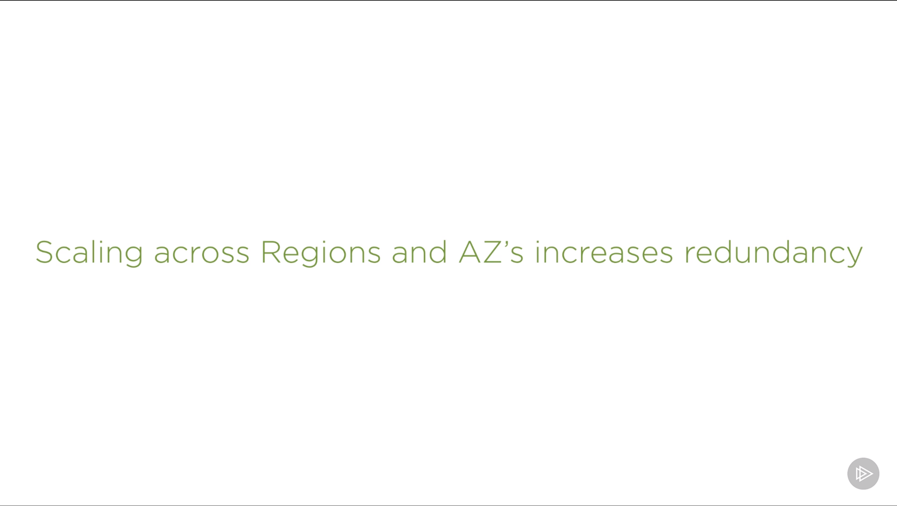
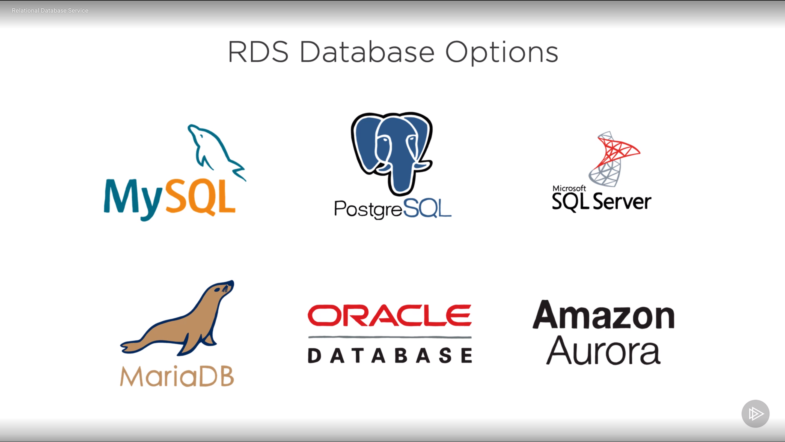
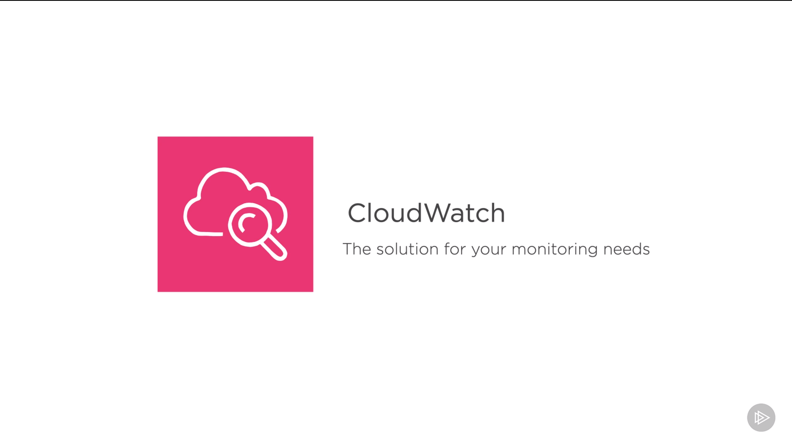
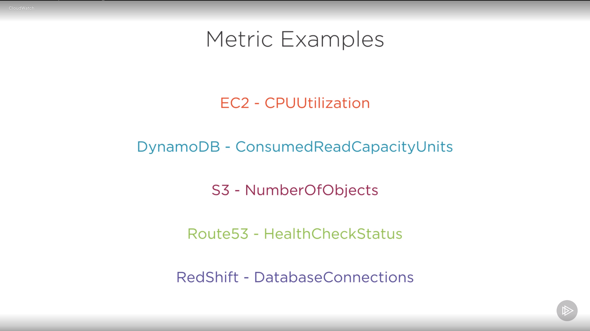
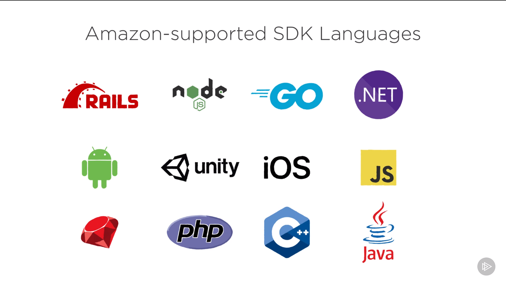
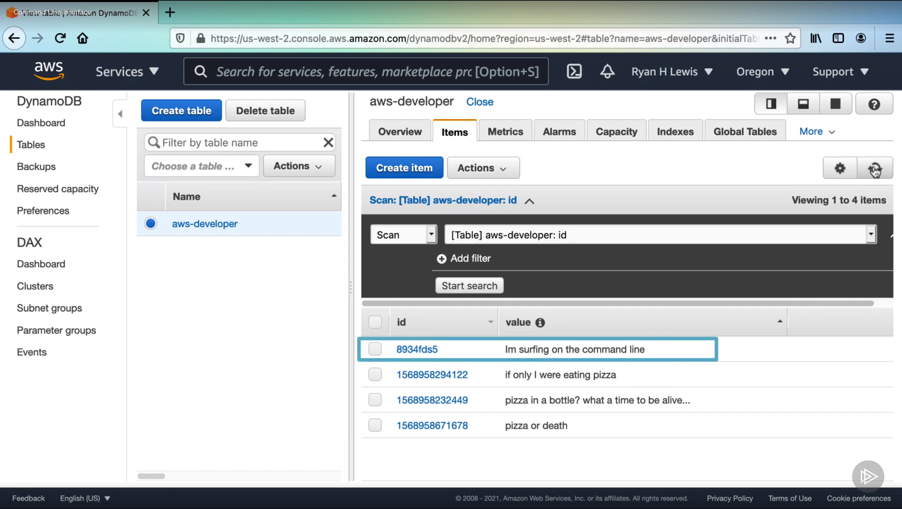

# AWS Developer: The Big Picture

<https://app.pluralsight.com/library/courses/aws-developer-big-picture>

## 1 - What is AWS?

### The Web Application Conundrum

### Hello Amazon Web Services

### Tracing the Global Infrastructure of AWS

### How Does AWS Work?

### AWS vs. the Rest

### Conclusion 1

## 2 - Understand the Core Services of AWS

### Elastic Cloud Compute

### Simple Storage Service

### Relational Database Service

### Route53

### Conclusion 2

## 3 - Enhancing Your App with AWS Databases and Application Services

### Elastic Beanstalk

### Lambda

### DynamoDB

### Virtual Private Cloud

### CloudWatch

### CloudFront

### Conclusion 3

## 4 Harnessing the Power of AWS from the Command Line to Code

### Web Console

### Software Development Kits

### Command Line Interface

### Conclusion 4

