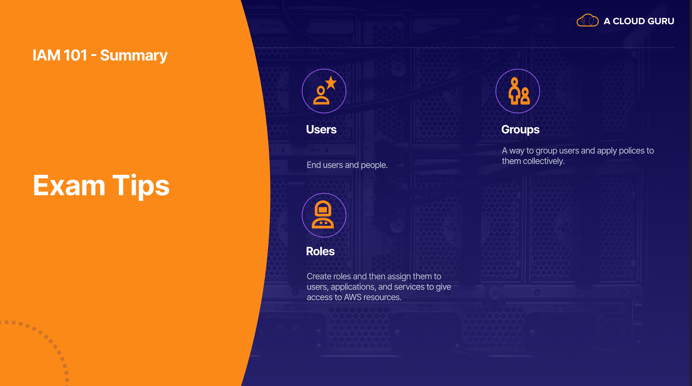

# AWS Certified Developer - Associate (DVA-C01)

[Pluralsight](https://app.pluralsight.com/library/courses/aws-certified-developer---associate-dva-c01/)

## 01 - Introduction

### [01] Introduction

- [Study Guide pt.1](./contents/01/1616618366085-Certified%20Developer%20Associate%20Study%20Guide%20PT%201.pdf)
  - [[Alt] A Cloud Guru (~1.9GB)](https://acloudguru-content-attachment-production.s3-accelerate.amazonaws.com/1616618366085-Certified%20Developer%20Associate%20Study%20Guide%20PT%201.pdf)
- [Study Guide pt.2](./contents/01/1616618442532-Certified%20Developer%20Associate%20Study%20Guide%20PT%202.pdf)
  - [[Alt] A Cloud Guru (~400MB)](https://acloudguru-content-attachment-production.s3-accelerate.amazonaws.com/1616618442532-Certified%20Developer%20Associate%20Study%20Guide%20PT%202.pdf)

### [01] Products

- <https://aws.amazon.com/products/>

### [01] Exam Blueprint

- [Exam Blueprint](./contents/01/1609870719995-S1_L4_The_Exam_Blue_Print.pdf)

### [01] AWS Recertification

- <https://aws.amazon.com/certification/recertification/>

### [01] Exam Guide

- [Exam Guide](./contents/01/AWS-Certified-Developer-Associate_Exam-Guide.pdf)

---

## 02 - Beginner's Guide to IAM

### [02] IAM 101

- [AWS IAM features](https://aws.amazon.com/iam/features/)
- [Slides](./contents/02/1609870881237-S2_L1_IAM_101.pdf)

### [02] IAM Demo

- [Creating a Free Tier Billing alert](https://aws.amazon.com/about-aws/whats-new/2017/12/aws-free-tier-usage-alerts-automatically-notify-you-when-you-are-forecasted-to-exceed-your-aws-service-usage-limits/)
- [Set up a new account](https://aws.amazon.com/premiumsupport/knowledge-center/create-and-activate-aws-account/)
- [Creating a Billing alert](https://docs.aws.amazon.com/AmazonCloudWatch/latest/monitoring/monitor_estimated_charges_with_cloudwatch.html)

### [02] Testing IAM Policy Permission

- [IAM Policy Simulator](https://policysim.aws.amazon.com/)
- [IAM Policy Simulator Documentation](https://docs.aws.amazon.com/IAM/latest/UserGuide/access_policies_testing-policies.html)
- [Slides](./contents/02/1609871350426-S2_L3_Testing%20IAM.pdf)

### [02] IAM 101 Summary

- [Security Best Practices Whitepaper](https://d1.awsstatic.com/whitepapers/Security/AWS_Security_Best_Practices.pdf)
- [Interactive Study Guide](https://acloudguru.visme.co/view/y4nxpkv4-aws-certified-developer-associate-studyguide-s02-beginners-guide-to-iam)
- [Slides](./contents/02/1609871717794-S2_L4_IAM_Summary.pdf)




---

## 03 - Beginner's Guide to EC2

### [03] Introducing EC2

### [03] EC2 Pricing Options

- [AWS Pricing Calculator](https://calculator.aws/)
- [Amazon EC2 Reserved Instances and Other AWS Reservation Models](https://docs.aws.amazon.com/whitepapers/latest/cost-optimization-reservation-models/cost-optimization-reservation-models.pdf)

### [03] Exploring EC2 Instance Types

- [EC2 Instance Types](https://aws.amazon.com/ec2/instance-types/)

### [03] Launching an EC2 Instance - Demo

### [03] How to Use Putty Demo (Windows Users Only)

### [03] Using EC2 Instance Connect - Demo

### [03] Understanding EBS Volumes

- [Amazon EBS Volume Types](https://aws.amazon.com/ebs/volume-types/)
- [EBS Volumes Documentation](https://docs.aws.amazon.com/AWSEC2/latest/UserGuide/ebs-volume-types.html)

### [03] Creating an EBS Volume - Demo

### [03] Exploring Elastic Load Balancer

- [Elastic Load Balancing features compared](https://aws.amazon.com/elasticloadbalancing/features/)
- [Create an HTTPS listener for your Application Load Balancer](https://docs.aws.amazon.com/elasticloadbalancing/latest/application/create-https-listener.html)
- [AWS Elastic Load Balancing: Support for SSL Termination](https://aws.amazon.com/blogs/aws/elastic-load-balancer-support-for-ssl-termination/)
- [Gateway Load Balancer](https://aws.amazon.com/elasticloadbalancing/gateway-load-balancer/)
- [Elastic Load Balancer Troubleshooting](https://docs.aws.amazon.com/elasticloadbalancing/latest/application/load-balancer-troubleshooting.html)

### [03] Route 53 Demo

- Bootstrap

```bash
 #!/bin/bash
 yum update -y
 yum install httpd -y
 echo "<html><body><h1>Hello Cloud Gurus</h1></body></html>" >/var/www/html/index.html
 systemctl start httpd
 systemctl enable httpd
```

### [03] CLI Demo Lab

- [AWS - CLI S3 reference doc](https://awscli.amazonaws.com/v2/documentation/api/latest/reference/s3/index.html)
- [AWS - CLI configure](https://docs.aws.amazon.com/cli/latest/userguide/cli-chap-getting-started.html)
- [AWS - CLI profiles](https://docs.aws.amazon.com/cli/latest/userguide/cli-multiple-profiles.html)
- [Instance metadata and user data](https://docs.aws.amazon.com/AWSEC2/latest/UserGuide/ec2-instance-metadata.html)

### [03] CLI Pagination

### [03] Working With The AWS CloudShell - Demo

### [03] EC2 with S3 Role Demo

### [03] RDS 101

### [03] RDS Demo

- [Bootstrap Script and RDS Commands](https://github.com/ACloudGuru-Resources/course-aws-certified-developer-associate/tree/main/RDS_Demo)

### [03] RDS Multi-AZ and Read Replicas

### [03] RDS Backups and Snapshots

### [03] Elasticache 101

### [03] Systems Manager Parameter Store

- [AWS Systems Manager Parameter Store](https://docs.aws.amazon.com/systems-manager/latest/userguide/systems-manager-parameter-store.html)
- [Systems Manage User Guide](https://docs.aws.amazon.com/systems-manager/latest/userguide/what-is-systems-manager.html)
- [AWS Secrets Manager FAQs](https://aws.amazon.com/secrets-manager/faqs/)

### [03] EC2 Summary - Part 1

- [Interactive Study Guide](https://acloudguru.visme.co/view/8r08r8nv-aws-certified-developer-associate-studyguide-s03-beginner-guide-to-ec2-part1)

### [03] EC2 Summary - Part 2

- [Interactive Study Guide](https://acloudguru.visme.co/view/8r08r6nq-aws-certified-developer-associate-studyguide-s03-beginner-guide-to-ec2-part2)
